# 01 · Product Requirements Document (PRD)

**Product:** Prospect Studio (working name)
**Type:** Internal desktop tool, proof of concept → pilot
**Owner:** Andy (Engineering) · **Stakeholders:** Marketing team, sales leadership, local dealers (indirectly)
**Status:** Draft v0.2, 2026-09-28

**Change in v0.2:** the user base is one small marketing team (< 5 people, possibly a single user), so the tool is local-first with outputs as files. The company is a **national distributor that sells through local dealers**, so dealer routing and campaign attribution are now core requirements.

---

## 1. Problem

The company is the national distributor for a line of lift equipment and sells through a network of local dealers. It wants to grow sales in dealer territories, but:

- finding companies that *likely need* the equipment in a given territory is manual and inconsistent,
- generic mailers get low response, and there's no designer capacity for personalization at scale,
- **when a dealer closes a deal, marketing can't tell whether a campaign had anything to do with it**, so campaign budgets are hard to justify.

## 2. Vision

> A marketer describes the ideal customer in plain English. The tool finds and explains the best-fit companies in a territory, assigns each to the right local dealer, and generates co-branded mailers personal enough to get noticed. Leads and postcards appear as files in a folder. Every card is traceable from mailbox to dealer to sale.

## 3. Goals & non-goals

**Goals**
- G1. Turn a natural-language brief into a reviewable, **evidence-backed** lead list for a user-defined territory.
- G2. Deliver the lead list as an **Excel workbook** the user can review and edit, with changes flowing back into the tool.
- G3. Generate *N* personalized postcard variants, refine them by text or voice, save a winner as a template, and apply it to all approved leads. Outputs are **PDF/PNG files in the campaign folder**.
- G4. **Route every lead to the right local dealer** and co-brand the outreach with that dealer.
- G5. **Attribute results**: responses, dealer follow-up, and sales traced back to campaign, creative, segment and dealer ([08](08-Dealer-Routing-and-Attribution.md)).
- G6. Show cost per search and per campaign before and after running.

**Non-goals (for now)**
- A central hosted server or multi-user system. The tool is local-first; one small hosted relay handles tracking only.
- Replacing the CRM or a dealer lead-management system. The tool feeds them.
- A dealer login portal. Dealers interact through email and spreadsheets.
- Fully automated sending with no human approval.
- Automated LinkedIn outreach (ToS risk).

## 4. Users & stakeholders

| Who | Role in the tool | Needs |
|---|---|---|
| **Marketing user** (1, maybe up to 4) | Primary and possibly only user: runs searches, reviews leads, designs cards, sends campaigns, reads reports | Fast, trustworthy lead lists; professional cards without a designer; proof that campaigns work |
| **Sales leadership** | Reads reports (files or screen share) | Campaign ROI, dealer performance, where coverage is thin |
| **Local dealers** (external) | Receive leads and alerts; report outcomes | Qualified, well-timed leads in their territory; no extra portal; protection of their existing customer relationships |
| **Prospects** (external) | Receive cards; scan, call or fill a form | A relevant, credible offer with a local contact |

Since the primary user is one person, the tool doesn't need roles, SSO or approval workflows between users. It still requires a **self-approval step** before anything is sent.

## 5. Core user journey

```mermaid
flowchart LR
  A[Describe target] --> B[AI builds Search Profile<br/>+ cost/market preview]
  B --> C[Run search<br/>resumable job]
  C --> D[Review leads<br/>in app or leads.xlsx]
  D --> E[Assign dealers<br/>optional dealer pre-review]
  E --> F[Postcard Studio<br/>variants · voice edits · template]
  F --> G[Batch render → folder<br/>QA + approve]
  G --> H[Send: print API / email drafts<br/>+ dealer lead packets]
  H --> I[Track: scans, calls, forms,<br/>dealer outcomes, sales matchback]
  I --> J[Attribution report<br/>feeds next search]
```

## 6. Functional requirements

Priority: **M** = must-have for POC, **S** = should (pilot), **C** = could (later).

### 6.1 Search Profile (ICP) builder
| ID | Requirement | Pri |
|---|---|---|
| SP-1 | User describes the target in free text (typed or dictated). AI converts it to a structured **Search Profile**: industries (NAICS + keywords), size range, facility traits, buying signals, exclusions. | M |
| SP-2 | Profile is shown as editable fields before running. | M |
| SP-3 | Geography: metro (CBSA), state, county, ZIP list, radius, **or a dealer's territory**. | M |
| SP-4 | **Preview before run:** estimated establishments (Census data), cost and time. | M |
| SP-5 | Save/clone profiles as `search-profile.json` in the campaign folder. | S |
| SP-6 | **Lookalike mode:** derive the profile from a list of best existing customers (e.g., warranty registrations). | S |
| SP-7 | Suppression list (workbook): existing end customers, dealer-reported customers, do-not-contact. | M |

### 6.2 Lead discovery & enrichment
| ID | Requirement | Pri |
|---|---|---|
| LD-1 | Pull candidates from multiple sources ([05](05-Data-Sources.md)) and deduplicate into company/site records. | M |
| LD-2 | Enrich: website summary, industry, size, facility info, signals (permits, hiring, expansions, news). | M |
| LD-3 | Score 0–100 with a **plain-English rationale and cited evidence**. | M |
| LD-4 | Tiered enrichment: cheap pass for all; deep research for the top slice or on demand. | M |
| LD-5 | Find decision-maker contacts where a licensed source allows; default to "Attn: Facilities Manager". | S |
| LD-6 | Jobs are resumable after the laptop sleeps or restarts; progress, pause/cancel, hard budget cap. | M |
| LD-7 | Record source provenance and license for every field. | M |

### 6.3 Lead review
| ID | Requirement | Pri |
|---|---|---|
| LR-1 | In-app grid: sort, filter, inline edit, bulk approve/reject. | M |
| LR-2 | **`leads.xlsx` round-trip:** app writes the workbook (status dropdowns, evidence hyperlinks, hidden LeadId); edits saved in Excel are imported back automatically. | M |
| LR-3 | Detail panel: summary, evidence, live map / Street View (viewed, not stored), dealer, notes. | M |
| LR-4 | Chat with the list ("remove anything under 20 employees", "why is #14 high?"). | S |
| LR-5 | Feedback (approve/reject reasons, later dealer outcomes) tunes scoring. | S |
| LR-6 | Native Google Sheets (publish + pull edits). The `.xlsx` is Google-Sheets-compatible regardless. | S (M if the team uses Google Workspace) |

### 6.4 Dealer routing
| ID | Requirement | Pri |
|---|---|---|
| DR-1 | Import a territory map (ZIP/county → dealer/branch) from a spreadsheet. | M |
| DR-2 | Auto-assign each lead to a dealer; the user can override in the app or the workbook. | M |
| DR-3 | Flag leads with no dealer coverage; include them in a coverage-gap report. | S |
| DR-4 | Generate a **dealer pre-review** workbook per dealer (existing customer / in discussion / do not contact) and import responses. | S |
| DR-5 | Generate a **dealer lead packet** (PDF brief per lead + workbook) per dealer in the campaign folder. | M |

### 6.5 Postcard Studio
| ID | Requirement | Pri |
|---|---|---|
| PC-1 | Campaign content: headline, slogan, tagline, offer, CTA, product(s). AI can draft these. | M |
| PC-2 | AI generates **N variants** (default 4) varying layout, tone and image composition. | M |
| PC-3 | Refine by typed or **spoken** instruction; undo/redo. | M |
| PC-4 | Personalized hero image from a licensed source; source and license recorded per image ([04 §5](04-Postcard-Generation.md#5-imagery-sources--licensing-read-this-first)). | M |
| PC-5 | **Save as template** with merge fields, including **dealer fields** (name, city, tracking phone). | M |
| PC-6 | Apply template to all approved leads → previews + AI QA flags → **files written to `postcards\print` and `postcards\email`**, plus a combined `proofs.pdf`. | M |
| PC-7 | Per-lead override without breaking the template. | S |
| PC-8 | Brand kit folder: logos, colors, fonts, product cutouts, legal footer, dealer logos (optional). | M |
| PC-9 | A/B variants within one campaign. | S |

### 6.6 Delivery, tracking & attribution
| ID | Requirement | Pri |
|---|---|---|
| DL-1 | Print-ready PDF (with bleed) and email PNG per lead in the campaign folder. | M |
| DL-2 | Send physical mail via API (Lob / PostGrid) with address verification; pull delivery status. | S |
| DL-3 | Email: create drafts in Outlook with CAN-SPAM footer and unsubscribe. | S |
| DL-4 | Human approval step before any batch is sent. | M |
| AT-1 | **Unique tracking code per lead** printed as QR, short URL and offer code. | M |
| AT-2 | **Landing page + quote form per campaign**, co-branded with the dealer, reading the lead code from the URL. Preferably in **HubSpot**; custom relay as fallback. The desktop app syncs leads out and responses back. | S (POC can use a simple page) |
| AT-3 | **Dealer alert email** on response, with one-click outcome links. | S |
| AT-4 | Import dealer outcomes (email links, returned workbooks). | S |
| AT-5 | **Holdout group**: randomly keep 10–20% of approved leads unmailed, stratified by tier/dealer. | S |
| AT-6 | **Sales matchback** against warranty/registration/dealer sales data. | S |
| AT-7 | Attribution report (`reports\attribution.xlsx`): funnel by campaign, dealer, segment, creative; lift vs holdout. | S |
| AT-8 | Tracked phone number per dealer per campaign. | C |

### 6.7 Settings & governance
| ID | Requirement | Pri |
|---|---|---|
| AD-1 | API keys stored in Windows Credential Manager. | M |
| AD-2 | Per-campaign budget caps; cost ledger per API call. | M |
| AD-3 | Log of AI prompts/outputs and sends (local). | S |
| AD-4 | Choose the root folder (local, OneDrive or Teams). | M |

## 7. Non-functional requirements

- **Users:** 1–5, each on their own Windows 10/11 PC. No shared server beyond the tracking relay.
- **Scale per campaign:** up to ~5,000 candidates, ~1,000 postcards.
- **Resilience:** long jobs checkpoint and resume; nothing is lost when the laptop sleeps.
- **Transparency:** every lead claim has a source; every cost is estimated before it's spent.
- **Compliance:** data-source licenses (storage/caching), image licensing for print, CAN-SPAM for email, dealer data handled as confidential.
- **Install:** one installer with auto-update; no admin rights if possible.

## 8. Scope by phase

| Phase | Scope | Outcome |
|---|---|---|
| **0 · Pitch** (now) | Specs + clickable mockup + one hand-run demo for a real dealer territory | Buy-in; choose pilot product, territory and 1–2 friendly dealers |
| **0.5 · Claude-native POC** (~3–5 wks part-time; **chosen**, see [poc/](../poc/README.md)) | C# MCP tools + skills in Claude Desktop/Cowork; outputs `leads.xlsx` and postcard PDFs to a folder | Real leads and cards quickly, to validate quality before building the app |
| **1 · Desktop POC** (~4–6 wks) | SP-1..4, SP-7, LD-1..4, LD-6..7, LR-1..3, DR-1..2, DR-5, PC-1..6, PC-8, DL-1, DL-4, AT-1, AD-1..2, AD-4 | The user produces a reviewed, dealer-assigned list and print-ready co-branded cards with tracking codes |
| **2 · Pilot** (~6–8 wks) | Mail API, tracking relay, dealer alerts and outcome links, holdout, dealer pre-review, lookalike, A/B | First mailed campaign with 1–2 dealers and a measured funnel |
| **3 · Expand** | Sales matchback, lift reporting, watchlists/alerts, existing-customer campaigns, coverage-gap reports | Proven campaign ROI; repeatable program across dealers |

## 9. Success metrics

| Metric | POC target | Pilot target |
|---|---|---|
| User-rated "good lead" rate (top 50) | ≥ 70% | ≥ 75% |
| Time to a reviewed, dealer-assigned lead list for a metro | < 1 hour | < 30 min |
| Postcard variant accepted within ≤ 3 edit rounds | ≥ 80% | ≥ 90% |
| Response rate (scan / visit / call / form) | — | ≥ 2–5% (vs current mailers) |
| Dealer feedback coverage (leads with any reported outcome) | — | ≥ 60% |
| Median dealer time to first contact after a response | — | < 2 business days |
| Attributed wins (direct + assisted) per 100 mailed | — | Baseline, tracked |
| Cost per mailed lead / per response / per win | Measured | < $3–5 / tracked / tracked |
| Incremental lift vs holdout | — | Directional after 3+ campaigns |

## 10. Risks

| Risk | Mitigation |
|---|---|
| Imagery licensing (Street View prohibited in print) | Licensed-source pipeline; license stored per image; renderer blocks unlicensed print ([04](04-Postcard-Generation.md)) |
| Hallucinated facts about prospects | Evidence-required scoring; citations; human review |
| **Dealers don't report outcomes** | One-click email links; offer codes tied to reimbursement; matchback against sales data |
| **Channel conflict** (mailing a dealer's existing customer) | Dealer pre-review; dealer-reported customers in the suppression list |
| **Dealer slow to follow up** | Instant alerts; SLA metric by dealer; national marketing CC'd |
| Tracking fails when the laptop is off | Hosted relay independent of the desktop app |
| Costs on large territories | Preview + budget caps + tiered enrichment |
| AI distorts the product in images | Composite the real product photo; AI only harmonizes; QA step |
| Single user = single point of failure | Campaign folder on OneDrive/Teams; DB backup to that folder |

## 11. Open questions

See [09 · Sales Team Discussion Guide](09-Sales-Team-Discussion-Guide.md) for business questions, [07 · Open Questions](07-Open-Questions.md) for technical questions and decisions, and [08 §11](08-Dealer-Routing-and-Attribution.md#11-decisions-needed-from-the-business) for attribution decisions.
