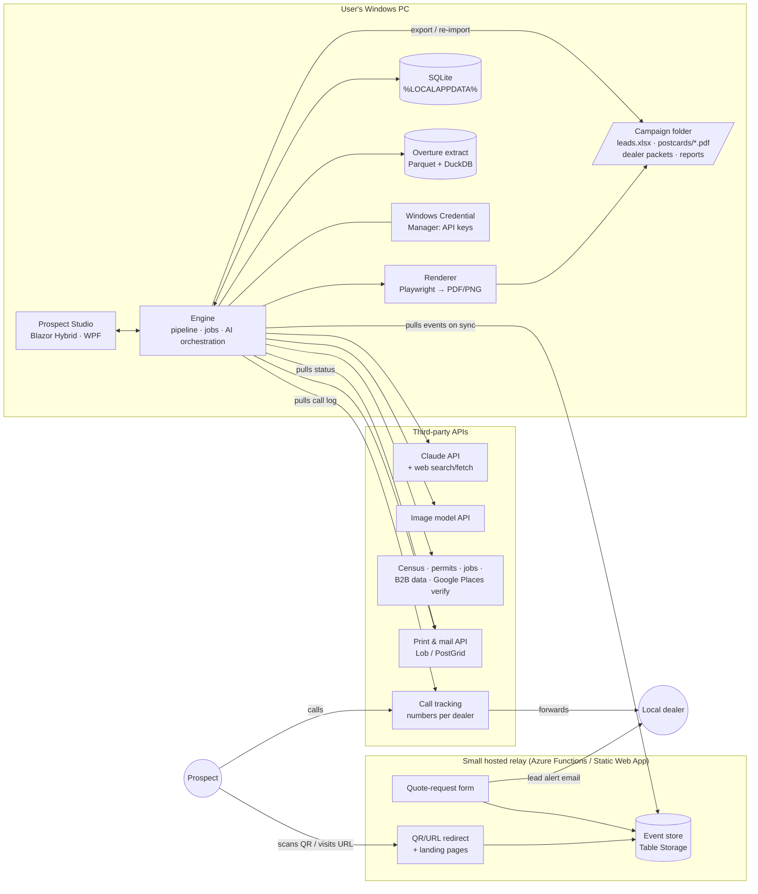
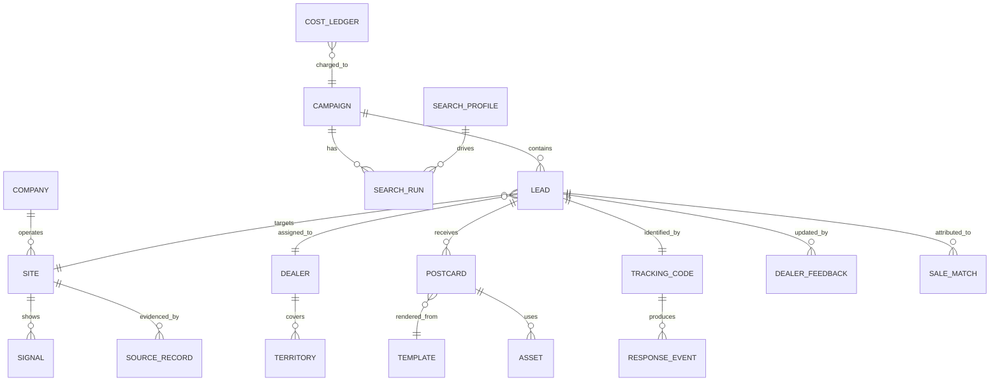

# 02 · Architecture (high level)

**Status:** Draft v0.2.1, 2026-09-28. This doc captures direction, not final decisions. Decisions go to [07](07-Open-Questions.md#decision-log) and later to `adr/`.

**Change in v0.2:** the audience is one marketing team of fewer than 5 people, and possibly a single user. The design is now **local-first**: the app runs on the user's Windows machine, and its results are ordinary files in a folder. Only one small hosted piece remains, for tracking QR scans and responses.

---

## 1. Design drivers

| Driver | Consequence |
|---|---|
| 1–5 users, likely 1 | No need for a central server, multi-tenancy, SSO or role management. |
| Users like seeing the tool "in house" | App and data live on their machine. Outputs are **files in a folder**: postcards as PDF/PNG, leads as an Excel workbook. |
| Sales close through **local dealers** | Attribution needs something reachable from the internet (QR/URL, form, call numbers) that works even when the user's laptop is off. See [08](08-Dealer-Routing-and-Attribution.md). |
| Heavy work is API calls, not local compute | AI, data sources, image generation and mail all run as cloud APIs the desktop app calls directly. A laptop is enough. |
| POC first, pitch to sales | Get to a working demo fast and keep throwaway work small. |

## 2. Options considered

| Option | Description | Verdict |
|---|---|---|
| **A. Local desktop app** (Blazor Hybrid in WPF) | C# app; UI in Razor/HTML hosted in WebView2; SQLite; writes files to a campaign folder | **Recommended for the product** |
| B. Claude-native POC (Cowork/Claude Desktop + custom MCP tools + skills) | Build only the data tools (as a C# MCP server) and a few skills; Claude does the orchestration; outputs land in a folder | **Chosen as the first build (D13).** Handoff pack in [poc/](../poc/README.md). The engine carries over to option A unchanged |
| C. Hosted web app (Blazor on Azure) | Central server and DB | Not needed for 1–5 users. Revisit only if dealers or many reps become users |
| D. Pure WPF/WinUI UI | Native XAML UI | Works, but postcard preview and editing is much easier in HTML/CSS. The same HTML later renders the PDF |

### Why Blazor Hybrid (WPF host)
- Stays in C#/.NET, the team's stack.
- The UI is HTML/CSS, the same technology that renders the postcards. What the user previews is exactly what prints.
- It is a real desktop app with full file system access, a tray icon and "Open folder" buttons, and it opens files in Excel.
- The Razor components can be moved to a hosted web app later (option C) without a rewrite.

### Why also consider the Claude-native path first
For a single user, much of the "app" is orchestration that Claude already does well: interpreting the brief, researching companies, writing copy, and producing files. A **Phase 0** that ships:
- 3–4 **MCP servers in C#** (geography/market size, Overture places, permits/signals, postcard renderer),
- a few **skills** (lead research playbook, scoring rubric, postcard brand rules),

would let the marketing user run real campaigns in Claude Desktop/Cowork within a couple of weeks, with the leads workbook and postcard PDFs landing in their folder. The dedicated app (A) then adds what a chat can't do well: bulk review grids, batch rendering at scale, a template library, deterministic costs, and attribution dashboards.

## 3. System context (option A)



> **Update:** the team likely already uses **HubSpot**. If its Marketing Hub tier includes landing pages, forms and workflows, **HubSpot takes the relay's role**. Prospect Studio then pushes approved leads (with tracking codes, dealer and cohort) to HubSpot and pulls responses back, and the custom relay below is only a fallback. See [08 §6b](08-Dealer-Routing-and-Attribution.md#6b-using-hubspot-for-tracking-and-routing).

**The relay is the only always-on component.** A postcard's QR code has to resolve when the prospect scans it, whether or not the marketing user's laptop is on. The relay:
- redirects `go.<brand-domain>/<code>` to a landing page personalized for the lead and co-branded with the dealer,
- hosts a "request a quote" form that emails the assigned dealer (and CCs marketing),
- stores events (scan, visit, form submit),
- exposes one authenticated endpoint the desktop app calls to **pull** new events.

It has no lead database of its own, only codes mapped to minimal display data (company short name, dealer name and contact) that the desktop app pushes when a batch is sent. Cost on Azure Functions Consumption and Table Storage: typically a few dollars a month or less. A low-code alternative is a link-tracking service (e.g., Bitly) plus a form tool. It's simpler, but the event data is harder to join back to leads.

## 4. Inside the desktop app

### 4.1 Engine (a class library, UI-independent)
- **Pipeline** (search → dedupe → enrich → score → assign dealer): deterministic steps. The LLM is called at fixed points with JSON-schema outputs. See [03](03-Lead-Search-Strategy.md).
- **Interactive agent**: profile builder, "why is this lead ranked here?", "research deeper", and voice/text postcard edits. It uses the official **Anthropic C# SDK** (NuGet `Anthropic`) with tool use.
- **Jobs**: a local job queue persisted in SQLite. Every work unit is checkpointed, so a state-wide search survives a closed laptop and **resumes** where it stopped. Progress shows in the UI and as a tray notification.
- **Cost ledger + budget caps**: every paid call is recorded, and a job pauses when it reaches its cap.
- **Tool adapters** implement one interface and can also be exposed as MCP servers (shared with the option B path).

### 4.2 Files as the user-facing surface
Each campaign is a folder, by default under `Documents\Prospect Studio\`. It can also be a OneDrive/Teams folder if the team wants to share outputs.

```
Documents\Prospect Studio\
├─ Brand Kit\                        logos, fonts, product cutouts, legal footer
├─ Templates\                        saved postcard templates (*.json + thumbnail.png)
└─ Campaigns\
   └─ 2026-10 Houston Scissor Lifts\
      ├─ leads.xlsx                  ← review & edit here (round-trips to the app)
      ├─ search-profile.json
      ├─ postcards\
      │  ├─ print\  L0001_Bayou-Fulfillment.pdf …   (with bleed, 300 dpi)
      │  ├─ email\  L0001_Bayou-Fulfillment.png …
      │  └─ proofs.pdf               ← all cards on one PDF for sign-off
      ├─ dealers\
      │  └─ Gulf Lift Equipment - Houston\
      │     ├─ lead-packet.pdf       ← one-page brief per lead for the dealer
      │     └─ leads.xlsx            ← the dealer's leads, with feedback columns
      ├─ mailing\  manifest.csv, print-vendor receipts
      └─ reports\  attribution.xlsx
```

### 4.3 Excel round-trip (leads.xlsx)
- **SQLite is the source of truth; the workbook is the working view.** The app writes `leads.xlsx` (ClosedXML) with frozen headers, filters, and dropdowns (data validation) for `Status` (Approve / Reject / Hold) and `Dealer`, plus a `LeadId` column. The file uses only features that also work in **Google Sheets, Excel for the web and LibreOffice** ([POC design §9](../poc/technical-design.md#9-workbook-leadsxlsx)).
- The user can review in Excel. When the file is saved, a `FileSystemWatcher` notices, and the app **imports changes** by `LeadId`: status, notes, edited contact name, dealer override. Conflicts (the app changed a row the user also edited) are shown for the user to resolve.
- Evidence links are real hyperlinks, so each claim is one click away.
- **Google Sheets:** the `.xlsx` can be edited directly in Google Sheets from a Drive-synced folder, with no API needed. A native Google Sheet via the Sheets API (OAuth, `drive.file` scope) is an optional chunk, promoted if the team works in Google Workspace.

### 4.4 Rendering
- Designs are **JSON specs** over a library of HTML/CSS layouts. AI edits are JSON Patches. See [04](04-Postcard-Generation.md).
- **Microsoft.Playwright** (headless Chromium) prints PDF/PNG locally. It needs a one-time ~150 MB browser download at install time.
- The preview in the app uses the same HTML inside WebView2, so what the user sees is what gets printed.

### 4.5 Data model (first cut, SQLite via EF Core)



What changed from v0.1: **DEALER / TERRITORY** (ZIP or county → dealer), **TRACKING_CODE** (one per lead: QR/URL slug + human-readable offer code), **DEALER_FEEDBACK** (what the dealer reported about the lead), and **SALE_MATCH** (lead ↔ a reported sale). Leads also carry a `cohort` flag (`mailed` / `holdout`) for measuring lift. Details are in [08](08-Dealer-Routing-and-Attribution.md).

## 5. Technology choices (proposed)

| Concern | Choice | Notes |
|---|---|---|
| Runtime | .NET 10 (LTS), Windows 10/11 | |
| Shell / UI | WPF + `BlazorWebView` (WebView2); MudBlazor or Fluent UI Blazor | Razor components in a class library |
| Local DB | SQLite + EF Core | Single file under `%LOCALAPPDATA%` |
| Overture places | Monthly US Parquet extract + DuckDB.NET | ~few GB on disk. Alternatively download per state on demand |
| Excel | ClosedXML (MIT) | Round-trip by `LeadId` |
| AI | Anthropic C# SDK; Claude web search / web fetch server tools | |
| Image gen/edit | Gemini image or OpenAI image API behind `IImageEditor` | Bake-off decides ([04 §6](04-Postcard-Generation.md#6-putting-the-machine-in-the-picture)) |
| Rendering | Microsoft.Playwright for .NET | |
| Speech | Windows speech recognition or Azure AI Speech / Whisper API | Dictating edits is optional |
| Secrets | Windows Credential Manager (DPAPI) | Each user's own keys; nothing in plain config files |
| Packaging & updates | Velopack or MSIX | One-click install and auto-update from a file share or GitHub release |
| Tracking & dealer notifications | **HubSpot** landing pages, forms, workflows (preferred, if the tier allows) | Fallback: Azure Functions + Table Storage + Static Web App relay |
| CRM integration | HubSpot API (companies/contacts, custom properties, campaign association) | Salesforce role TBD (dealer portal?) |
| QR codes | Generated in the app (e.g., QRCoder, MIT), one per lead, pointing at the landing page with the lead's code | HubSpot doesn't bulk-generate per-contact QR codes |
| Call tracking (optional) | CallRail or Twilio numbers per dealer/campaign | A few dollars per number per month |

## 6. Cost model (order of magnitude, to be validated)

Assumptions: one metro campaign; ~3,000 raw candidates → ~800 after filtering → top 200 deep-researched → 150 approved and mailed.

| Item | Unit cost (approx.) | Metro campaign |
|---|---|---|
| Light LLM pass on 800 (small model) | ~$0.002–0.01 | ~$2–8 |
| Deep research on 200 (web search + fetch + larger model) | ~$0.05–0.20 | ~$10–40 |
| Google Places verification (200) | ~$0.03 | ~$6 |
| Image generation/edit | ~$0.01–0.15 | ~$5–25 |
| Print + First Class postage, 6×9 | ~$0.66–1.03 | ~$100–155 |
| Tracking relay, call numbers | monthly | ~$5–30/month |
| **Total** | | **≈ $125–240, about $1–1.60 per mailed lead** |

No server hosting costs beyond the relay. Data vendor subscriptions (B2B firmographics, permits) are extra and optional for the POC.

## 7. Security & compliance

- API keys stay in Windows Credential Manager, never in the campaign folder.
- The campaign folder contains prospect business data. If it's on OneDrive/Teams, it inherits the company's sharing controls.
- The relay holds only tracking codes, company short names and dealer contact info, and form submissions are forwarded to the dealer. Retention: 24 months, then purge.
- Store only what source licenses allow (e.g., Google content: `place_id` only).
- Human approval before any batch goes to print or email.

## 8. Growth path (if more users appear)

1. **2–5 users:** each runs the desktop app; shared `Brand Kit` and `Templates` folders on OneDrive/Teams; per-user SQLite is fine because campaigns rarely overlap. A shared suppression list lives as a workbook in the shared folder.
2. **Dealers as users** (co-op marketing portal) or many reps: move the Engine behind an ASP.NET Core API, SQLite → Azure SQL, and host the Razor components as a web app (option C). The engine code moves as is.

## 9. Next architecture steps

1. Spike: Overture US extract + DuckDB query for one metro and one NAICS set (1 day).
2. Spike: Phase 0 MCP server in C# (`find_places`, `estimate_market`) used from Claude Desktop, with the leads workbook written to a folder (2–3 days).
3. Spike: JSON design spec → HTML → PDF with bleed via Playwright; preview in a WPF BlazorWebView (2 days).
4. Spike: HubSpot round-trip: push 10 test companies with custom properties → landing page with `?code=` hidden field → form submit → workflow email to a test "dealer" → pull the submission back (1–2 days, needs HubSpot admin access). Fallback spike: custom relay.
5. Bake-off: image compositing on 10 real sites ([04 §6](04-Postcard-Generation.md#6-putting-the-machine-in-the-picture)).
6. ADRs: local-first desktop (D3), dealer attribution approach (D11), image provider (D9).
