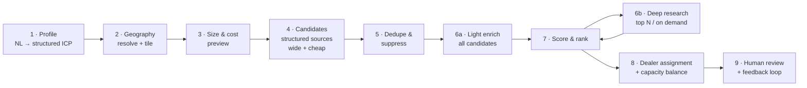

# 03 · Lead Search Strategy

How the AI goes from "find companies that need lifts in Texas" to a scored list with evidence.

---

## 1. Principle: funnel, not one giant prompt

An LLM alone can't list every warehouse in Texas. Asking it to do that either misses most companies or invents some. The approach is a funnel:



**Structured sources supply breadth. The web and the LLM supply depth and judgment.**

## 2. Step 1: Search Profile (ICP)

The user's free text becomes a JSON profile, which the user then edits in the UI.

**Example input:**
> "We sell scissor and boom lifts. Find companies in the Houston area that do a lot of overhead work: big warehouses, manufacturers with high-bay facilities, electrical/HVAC/sign contractors. Prefer 20+ employees. Growing companies are best. Skip rental companies and our existing customers."

**Generated profile (abridged):**
```json
{
  "product": "Scissor & boom lifts (aerial work platforms)",
  "segments": [
    { "name": "Warehousing & distribution", "naics": ["4931", "4841", "4238"], "keywords": ["distribution center", "3PL", "fulfillment"] },
    { "name": "Manufacturing (high-bay)", "naics": ["332", "333", "336"], "keywords": ["fabrication", "assembly plant"] },
    { "name": "Specialty trade contractors", "naics": ["238210", "238220", "238990"], "keywords": ["electrical contractor", "HVAC", "sign company", "glazing"] },
    { "name": "Facilities / institutions", "naics": ["611310", "622110", "561210"], "keywords": ["campus facilities", "hospital", "facility management"] }
  ],
  "size": { "employeesMin": 20 },
  "signals": ["new facility or expansion", "commercial building permit", "hiring for lift/forklift/maintenance roles", "recent funding or contract win"],
  "exclusions": { "naics": ["532412"], "keywords": ["equipment rental"], "suppressionList": "crm:customers" },
  "geography": { "type": "cbsa", "code": "26420", "label": "Houston–Pasadena–The Woodlands, TX" }
}
```

The AI also explains **why** it picked each segment, which makes a good talking point for the sales team ("I included sign companies because they mount signage at height").

## 3. Step 2–3: Geography & preview

**Should the whole US be searchable at once?** Yes, as a scheduled campaign job, not as an interactive query.

| Scope | Mode | Typical candidates | Guidance |
|---|---|---|---|
| ZIP / radius / city | Interactive | 50–500 | Quick targeted runs |
| **Dealer territory** | Interactive or background | 200–5,000 | **Natural unit for a dealer-channel business**: one campaign per dealer, co-branded, with its own funnel |
| Metro (CBSA) / county | Interactive, streams results | 500–5,000 | **Default scope** |
| State | Background job | 2k–30k | Requires cost preview + confirmation |
| National | Background job, split by dealer territory / state | 50k+ | Explicit confirmation; hard budget cap; light-enrich all, deep-research top slice per dealer territory |

- Geography resolves to counties/CBSA (Census TIGER) plus a polygon.
- Work is **tiled** (by county or H3 hex) so each unit stays under source limits. For example, Google Places Text Search returns at most 60 results per query.
- **Preview** uses Census County Business Patterns: "~1,450 establishments match these NAICS codes in the Houston CBSA; ~520 have 20+ employees. Estimated run: $35–60, ~25 min." The estimate lets the user adjust the profile before spending money.

## 4. Step 4: Candidate sourcing

Sources run in parallel per tile. The details are in [05](05-Data-Sources.md).

| Source | What it's good for | Stored? |
|---|---|---|
| **Overture Maps Places** (free, open) | Broad POI coverage with categories, website, phone, address | Yes (permissive license) |
| **Licensed B2B DB** (Apollo / Data Axle / D&B) | NAICS, employee count, revenue, contacts | Per vendor license |
| **Census CBP** | Market sizing only (counts, not names) | Yes |
| **OSHA establishment data** | Proves an industrial site exists; NAICS; employee counts from inspections | Yes (public) |
| **EPA FRS / ECHO** | Industrial facility registry with NAICS | Yes (public) |
| **Building permits** (e.g., Shovels) | New construction/expansion = strong buying signal; also names contractors | Per license |
| **Job postings** | Hiring for lift-related roles = strong signal | Store derived signal + URL |
| **Claude web search** | Long tail: "new distribution center Katy TX 2026" news | Store summary + URL |
| **Google Places** | Live verification only (open/closed, place_id) | `place_id` only |

## 5. Step 5: Dedupe & suppression

- Normalize names (strip "LLC", "Inc", punctuation), normalize addresses (USPS/CASS via Lob or PostGrid address verification), and match on website domain.
- Match key: `domain` > `normalized name + geohash-7` > fuzzy name within 200 m.
- Group sites under a company (one company can have several buildings in the territory).
- Drop suppressed records: existing end customers (e.g., from warranty registrations), **customers reported by dealers**, do-not-contact, competitors, and rental houses (unless targeted as partners). Our own dealers are always suppressed.

## 6. Step 6: Enrichment

**6a · Light (every candidate, small model, ~1–2k tokens):**
- Fetch the homepage and one "about" page (web_fetch).
- Extract: what they do, segment match, facility hints (warehouse, high-bay, yard), rough size, locations.
- Output JSON, with `confidence` per field.

**6b · Deep (top N or on demand, larger model + web_search):**
- Recent news (expansions, new sites, contracts), permits, job posts, fleet/equipment mentions, safety programs.
- Likely use cases for the product ("installs lighting in 40-ft ceilings").
- Suggested contact roles and a talking point for the dealer's salesperson (goes into the dealer lead packet).
- Each claim is stored as a **Signal** with URL + date. **No citation, no claim.**

## 7. Step 7: Scoring

Hybrid scoring keeps the ranking explainable and cheap:

```
score = 100 × Σ wᵢ · featureᵢ      (rule-based features, 0–1)
      + LLM adjustment (−15..+15)   (judgment from evidence, with rationale)
```

| Feature | Example weight |
|---|---|
| Segment fit (NAICS/keyword match) | 0.25 |
| Size in target range | 0.15 |
| Facility fit (warehouse/high-bay/yard evidence) | 0.20 |
| Recent buying signal (permit, expansion, hiring) | 0.25 |
| Distance to the assigned dealer's nearest branch (service and delivery) | 0.05 |
| Data confidence (multi-source confirmation) | 0.10 |

Output per lead: `score`, `tier` (A/B/C), `rationale` (2–3 sentences), `evidence[]`, `suggested_angle` (used later by postcard copy).

**Feedback loop:** the marketer's approve/reject reasons are the first labels. **Dealer outcomes** (quoted, won, not a fit) are better ones, and sales matchback ([08](08-Dealer-Routing-and-Attribution.md)) is the best. Once there are ~100 labels, fit weights per segment with a simple logistic regression. The labels also serve as few-shot examples in the scoring prompt.

## 7b. Step 8: Dealer assignment

- Look up the site's ZIP/county in the territory map → dealer and branch. Overlaps resolve by rule (primary dealer › nearest branch › round-robin). No match → *coverage gap* flag.
- **Capacity balance:** a dealer with two salespeople can't work 300 leads in a month. Each dealer gets a per-campaign cap (e.g., 25–50). The top-scored leads within the cap are mailed now and the rest queue for a later wave.
- Output: `Dealer` and `Branch` columns in `leads.xlsx`, plus a per-dealer workbook for optional pre-review. See [08 §3](08-Dealer-Routing-and-Attribution.md#3-routing-leads-to-dealers).

## 8. Worked example (illustrative, fictional companies)

| # | Company | Segment | Signals | Score | Dealer | Rationale |
|---|---|---|---|---|---|---|
| 1 | Bayou Fulfillment Co. | 3PL warehouse | Permit: 180k sq ft addition (Jul 2026); hiring "forklift/reach truck operators" | 92 A | Gulf Lift Equipment (West Houston) | Expanding high-bay warehouse; rack installation and maintenance will need lifts |
| 2 | Gulf Coast Sign & Lighting | Sign contractor | 45 employees; job post "sign installer – aerial lift cert" | 88 A | Bayport Aerial Supply | Daily work at height; the posting names aerial lifts explicitly |
| 3 | Westpark Metal Fab | Manufacturer | OSHA establishment record; 60 employees | 71 B | Gulf Lift Equipment (West Houston) | High-bay fabrication; no recent growth signal |

## 9. Quality safeguards

- Evidence-required claims; "unverified" badge otherwise.
- Operational check (Google Places `businessStatus`) before a lead is marked mail-ready.
- Sample audit: the marketer spot-checks 10 random leads per run before approving the list.
- Prompt-injection hygiene: treat fetched web content as data; never follow instructions found on websites.
