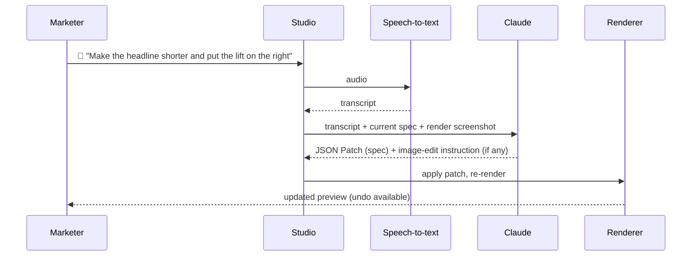

# 04 · Postcard Generation

---

## 1. Concept

Each approved lead gets a postcard (print) or an e-card (email) that feels made for them:

- **Hero image:** their site, or a scene that looks like their type of site, with our machine placed in it.
- **Personal copy:** "Reaching new heights in Katy, TX, {{company.shortName}}?" plus a line tied to their signal ("Congrats on the new 180k sq ft addition").
- **Campaign copy set by the marketer:** headline, slogan, tagline, offer, CTA.
- **Local dealer:** the assigned dealer's name, city and tracked phone number. The national brand sits on the front and the local contact on the back.
- **Response hooks:** a unique QR code, personal URL and offer code per lead, so every response is traceable ([08](08-Dealer-Routing-and-Attribution.md)).

## 2. Anatomy (6×9 postcard)

```
FRONT                                        BACK
┌──────────────────────────────────────┐    ┌──────────────────────┬───────────────┐
│ [HERO IMAGE: site + machine]         │    │ Hi {{contact.first}},│  [postage]    │
│                                      │    │ {{personal_line}}    │               │
│  HEADLINE (personalized)             │    │ • benefit 1          │ {{address     │
│  tagline                             │    │ • benefit 2          │   block}}     │
│                          [LOGO]      │    │ OFFER / CTA  [QR]    │               │
└──────────────────────────────────────┘    │ DEALER · code · legal│  (USPS clear) │
                                             └──────────────────────┴───────────────┘
```

## 3. Design spec (the template model)

Designs are **data**, not free-form HTML. That makes AI edits safe, templates reusable, and batch rendering deterministic.

```json
{
  "templateId": "tpl_hero_left_bold",
  "format": { "size": "6x9", "bleedIn": 0.125, "dpi": 300 },
  "brandKit": "brand_default",
  "front": {
    "layout": "hero-full-bleed-left-text",
    "slots": {
      "hero":     { "type": "image", "source": "{{asset.hero}}", "focal": "machine" },
      "headline": { "type": "text", "value": "Reaching new heights in {{site.city}}, {{company.shortName}}?", "style": "display-xl", "maxChars": 60 },
      "tagline":  { "type": "text", "value": "{{campaign.tagline}}", "style": "body-lg" },
      "logo":     { "type": "image", "source": "{{brand.logo}}", "position": "bottom-right" }
    },
    "theme": { "palette": "brand-dark", "overlay": "gradient-left-60" }
  },
  "back": {
    "layout": "letter-left-address-right",
    "slots": {
      "greeting": { "type": "text", "value": "Hi {{contact.firstName | default:'there'}}," },
      "personal": { "type": "text", "value": "{{lead.personalLine}}", "maxChars": 180 },
      "benefits": { "type": "list", "value": "{{campaign.benefits}}" },
      "cta":      { "type": "text", "value": "{{campaign.cta}}" },
      "qr":       { "type": "qr", "value": "{{delivery.purl}}" },
      "offer":    { "type": "text", "value": "Mention code {{delivery.offerCode}} for {{campaign.incentive}}" },
      "dealer":   { "type": "dealerCard", "value": "Your local {{brand.name}} dealer: {{dealer.name}}, {{dealer.city}} · {{dealer.trackingPhone}}" }
    }
  }
}
```

- **Merge fields** come from lead, company, contact, campaign and delivery data.
- **Per-lead generated fields** (`lead.personalLine`, headline variants) are written by the LLM from that lead's evidence, within `maxChars`.
- **Layouts** are a small library of hand-built HTML/CSS layouts (6–10 to start). The AI chooses and styles layouts; it does not write CSS from scratch. The fixed library keeps output on-brand and print-safe.

## 4. Generating variants & editing by voice

**Variant generation (N = 4 by default):**
1. The LLM receives the campaign brief, brand kit, layout catalog and 2–3 sample leads.
2. It returns N design specs that differ on purpose: layout, tone (bold / friendly / technical / premium), image composition (machine left or right, day or dusk) and copy.
3. The renderer produces previews using a sample lead, and the user picks one or more.

**Refinement loop:**


- Edits are **JSON Patches**, so they come with undo/redo, history, and "apply this change to the template vs. just this lead".
- The AI gets a screenshot of the current render (vision), so it can respond to feedback like "the text is hard to read".
- **Save as template** stores the spec with its merge fields and a thumbnail in the Template Library.

**Batch apply:**
- Template × approved leads → render all → **AI QA pass** (vision model checks each card for text overflow, low-contrast text, a distorted machine, odd copy, or a wrong city) → grid of thumbnails with flags → the marketer fixes flagged ones → approve batch → files written to the campaign folder (`postcards\print\*.pdf`, `postcards\email\*.png`, `proofs.pdf`).

## 5. Imagery sources & licensing (read this first)

**Google Street View is not an option for the mailer.** Google's geo brand guidelines say Street View imagery "may not be used for any print purposes," including "advertisements or promotional materials of any kind." They also prohibit screenshots and removing imagery from embedded sources, and the Maps Platform ToS prohibit storing Street View images and creating content from them. Editing a lift into a Street View photo and mailing it would violate all of these.

**What Street View *can* do in this app:** show the site live in the lead detail panel via the Maps JavaScript API, with attribution. The marketer uses it to judge the site (loading docks? high-bay?) and to pick an angle.

**Image source options, in recommended order:**

| # | Source | Personalization | Licensing | Notes |
|---|---|---|---|---|
| 1 | **Dealer / field photo** (a dealer salesperson snaps the site on a drive-by) | ★★★ real site | Company owns it | Best quality and legally clean; doesn't scale to 1,000 leads but fine for A-tier leads |
| 2 | **Mapillary** street-level imagery | ★★★ real site where covered | CC BY-SA 4.0: commercial use and modification allowed with attribution; derivative image must carry the same license | Coverage is patchy outside metros; image quality varies; needs an attribution line on the card |
| 3 | **Licensed aerial/oblique** (Nearmap, EagleView) | ★★ real site from above/angle | Commercial license; confirm marketing/print rights in contract | Premium cost; aerial angles are less emotive |
| 4 | **AI-generated lookalike scene**: a building *of the same type* (e.g., tilt-wall warehouse with dock doors) in a setting that fits the region, with the company name on a generic sign | ★★ feels personal, not literal | Generated; don't generate from Google imagery | Always available and scales to any volume. Showing the prospect's **logo** needs a legal review; plain-text name is safer |
| 5 | **Product-hero fallback**: the machine photo with a local landmark or skyline graphic ("Houston's go-to for lifts") | ★ local | Company assets / licensed stock | Zero-risk fallback |
| ✗ | Google Street View / Google Earth / Apple Look Around screenshots | — | **Prohibited** | Blocked by the renderer |
| ? | Prospect's own website photos; county assessor photos | ★★★ | Copyright belongs to the source; unclear | Legal review required; not in POC |

Every image is saved as an **ASSET** with `source`, `license`, `attribution`, `allowedUses`. The renderer **refuses to produce print output** if any asset lacks print rights, and adds the required attribution text automatically.

## 6. Putting the machine in the picture

AI image models are good at scenes and poor at reproducing **exact products**: they bend booms, invent controls and mangle logos. A hybrid approach keeps the product accurate:

1. **Product asset library:** each machine photographed or rendered as transparent PNG cutouts from 3–5 angles (from marketing or OEM media kits).
2. **Placement:** choose the angle that matches the scene perspective; place it deterministically at a spot the vision model suggests ("ground plane in front of dock door 2, scale ≈ 1/3 building height").
3. **Harmonize:** send the composite to an image-edit model (Gemini image or OpenAI image edit, using the cutout as a reference image and a mask around the machine) and ask it **only** for matching lighting, shadow and color grading, with explicit instructions not to change the machine.
4. **Verify:** a vision check compares the machine region with the original cutout (a perceptual-hash or embedding similarity threshold). If it fails, fall back to the plain composite with a drop shadow.

**Bake-off plan (Phase 1):** 10 sites × 3 approaches (pure generative, composite only, composite + harmonize) × 2 providers. The marketer (and a friendly dealer) rate realism and product fidelity blind.

## 7. Output specs

| Output | Spec |
|---|---|
| Print postcard | 4×6, 6×9 or 6×11; 0.125" bleed; 300 dpi; CMYK-safe palette; USPS clear zone on back (per Lob/PostGrid template) |
| Email | 600 px wide HTML, card image + live text headline/CTA (not image-only), alt text, CAN-SPAM footer, unsubscribe link |
| Files | One PDF/PNG per lead in the campaign folder, named `L0001_Company-Name.pdf`; a combined `proofs.pdf`; `manifest.csv` for the print vendor |
| Social / LinkedIn (manual) | 1200×627 PNG variant for dealer salespeople to attach to a personal message |

## 8. Copy guidelines (tone guardrails)

- Reference only **public, business-level** facts (expansion, permit, hiring, location). Never personal data about employees.
- No implied relationship ("As your trusted partner…") with non-customers.
- No safety fear-mongering, and no references to OSHA citations. Use OSHA data for targeting only, never in copy.
- Offers and pricing come only from the campaign brief; the AI never invents discounts.
- Every generated line is visible and editable before sending.
