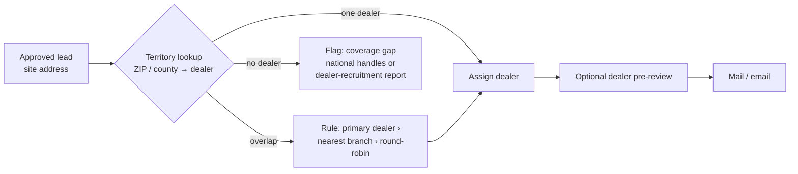

# 08 · Dealer Routing & Attribution

**Status:** Draft v0.2, 2026-09-28 (HubSpot option, measurement designs, working assumptions)

---

## 1. The business problem

The company is the **national distributor**. It sells mainly (or only) **through local dealers**. Marketing runs the campaign, but the dealer usually closes the sale, and the national distributor often sees only the dealer's wholesale order, not which end customer it was for.

Without deliberate design, a campaign produces postcards and hope. The tool has to answer:

1. **Which dealer** should each lead go to?
2. **Did the prospect respond**, and did the dealer follow up?
3. **Did it turn into a sale**, and would that sale have happened anyway?

## 2. Attribution ladder

Several mechanisms stack, from easy and weak to harder and conclusive. The POC should do levels 1–2, and the pilot adds 3–5.

| Level | Mechanism | Proves | Effort |
|---|---|---|---|
| **1 · Engagement** | Unique QR code / personal URL per lead; tracked phone number per dealer; quote-request form | The prospect saw the card and acted | Low. HubSpot landing pages and forms ([§6b](#6b-using-hubspot-for-tracking-and-routing)) or the small tracking relay ([02 §3](02-Architecture.md#3-system-context-option-a)) |
| **2 · Dealer-confirmed** | The dealer reports each lead's outcome (contacted → quoted → won/lost) against its lead ID | The lead was worked, and how far it got | Low to medium. Depends on how easy reporting is for dealers |
| **3 · Offer-code redemption** | The card carries a short code (e.g., `LIFT-K7Q3MX`) for an incentive funded by the national distributor. The dealer submits the code to be reimbursed | Hard link from card to sale | Medium. Needs a business decision on the incentive |
| **4 · Sales matchback** | Match the mailed list against **warranty registrations** (likely available) and any dealer sales or rebate records within an attribution window. Optionally add a "mailer code" field to the warranty form | A sale happened at a mailed company, with or without a response | Medium. Needs access to sales data |
| **5 · Incremental lift** | Randomly **hold out** a share of qualified leads (not mailed) and compare sale rates | The campaign *caused* the extra sales, not just preceded them | Low to build. Needs patience to reach meaningful volume |

Level 3 matters most in a dealer channel. **The offer code gives the dealer a reason to report the sale** because it's how they get reimbursed. Levels 4–5 remove the dependence on dealer diligence.

## 3. Routing leads to dealers

- **Territory table**: ZIP or county → dealer (and branch). It's imported from a spreadsheet the national distributor likely already has, and kept in `Brand Kit\dealers.xlsx`.
- **Coverage gaps**: leads outside any dealer's territory are still valuable. They feed a "where we need a dealer" report (see [06](06-Ideas-Backlog.md)).
- **Dealer pre-review (recommended)**: before mailing, each dealer gets their slice of the list and can mark leads as *existing customer*, *already in discussion* or *do not contact*. This protects dealer relationships, gets their buy-in, and removes waste. Default rule: no response in 5 business days counts as approval.
- **Dealer on the lead record**: `Dealer` and `Branch` are columns in `leads.xlsx`, and the user can override them there.

## 4. What the prospect sees (co-branding)

- **Front:** national brand plus the personalized hero image (unchanged).
- **Back:** "Your local {{brand}} dealer: **{{dealer.name}}**, {{dealer.city}} · {{tracking phone}}", plus the QR code, personal URL and offer code.
- **Landing page** (`go.<brand>.com/K7Q3MX`): "Hi Bayou Fulfillment," product recommendation, spec sheet, a short video, the dealer's contact card, and a **"Request a quote"** form. The form submission goes straight to the dealer.

National brand for credibility, local dealer for service and speed. That's the channel story on one card.

## 5. Dealer handoff & feedback (keep it friction-free)

Dealers won't log into another portal. Feedback has to happen through tools they already use: email and spreadsheets.

| When | What the dealer gets | How they report back |
|---|---|---|
| Campaign sent | `dealers\<Dealer>\lead-packet.pdf` (one page per lead: who, why, suggested angle) + `leads.xlsx` | Optional. Fill the `Outcome` column and email it back; the app imports it by `LeadId` |
| Prospect responds (form, call, scan + visit) | **Instant email alert** from the relay: lead summary + what the prospect did | **One-click status links** in the email: `Contacted` · `Quote sent` · `Won` · `Not a fit`. Each is a signed URL on the relay; no login |
| 2 and 6 weeks after sending | Short reminder: "3 of your 12 leads have no update" | Same one-click links |
| Sale with offer code | Dealer submits the code with its reimbursement claim | The code is matched automatically |

Outcome values: `New` → `Contacted` → `Meeting/Demo` → `Quote sent` → `Won` / `Lost` / `Not a fit` / `Already a customer`. For `Won` the dealer adds units, model and approximate value, so reporting stays light.

**Dealer SLA metric:** time from response to first contact. It's often the biggest lever on conversion, and it's worth showing to sales management by dealer.

## 6. Tracking codes

- **One code per lead per campaign**: 6 characters, base32 without look-alike characters (no 0/O/1/I), e.g., `K7Q3MX`.
- Used three ways:
  - QR → `https://go.<brand>.com/K7Q3MX`
  - Printed short URL (for people who type)
  - Printed offer code `LIFT-K7Q3MX` (for phone calls and dealer counters)
- **Mixed-channel campaigns** add a channel suffix at the redirect (`?c=p` print, `?c=e` email), so one lead can be followed across touches.
- **Tracking phone numbers**: one per dealer per campaign (not per lead; that gets expensive). A call is attributed to a specific lead when the caller's number or company matches, or when they quote the offer code.

## 6b. Using HubSpot for tracking and routing

The sales team likely uses **HubSpot** (possibly Salesforce as well). If HubSpot's Marketing Hub is available, it can replace most of the custom tracking relay, and marketing already knows it.

**What HubSpot can likely handle** (confirm against the company's subscription tier):
- **Landing pages and forms.** A campaign landing page reads the lead's code from the URL (`?code=K7Q3MX`) into a hidden form field, so every quote request is tied to its card.
- **Tracking URLs / UTM parameters and campaign analytics** for visits and conversions.
- **Records**: prospects as companies/contacts with custom properties (`lead_score`, `dealer`, `tracking_code`, `cohort`, `campaign`); dealers as companies of type *Dealer*.
- **Workflows** (typically Professional tier): route a form submission by territory/ZIP property and send an **internal notification email to the dealer contact**, who doesn't need a HubSpot seat. A second short form ("Contacted / Quoted / Won") can act as the dealer's one-click outcome link, with the lead code pre-filled.
- **Direct-mail integrations** (Lob, PostGrid, Postalytics) that send postcards from a workflow, as an alternative to sending from Prospect Studio.
- **Dashboards** for the campaign funnel.

**Gaps to verify:**
- HubSpot is not known for bulk, per-contact QR code generation. Common practice is to generate QR codes from HubSpot tracking URLs with another tool. **Prospect Studio would generate one QR code per lead** pointing at the HubSpot page with the lead's code.
- **Scans without a form fill** appear as page views. Counting scans per card needs reporting on the code parameter, or a redirect/short-link service in front.
- **No native dealer portal.** HubSpot has no built-in partner relationship management. If dealers already live in **Salesforce** (e.g., an Experience Cloud partner portal), leads should probably flow there instead. This is a question for the team ([09 Q18–Q20](09-Sales-Team-Discussion-Guide.md#5-questions-for-the-team)).
- Workflow and custom-object features depend on the subscription tier.

**Proposed split of responsibilities:**

| Prospect Studio (desktop) | HubSpot |
|---|---|
| Find, research, score and route leads | System of record for the campaign and its contacts |
| Design and render cards (with QR codes) | Landing pages, quote forms, dealer notification workflows |
| Push approved leads + codes + dealer + cohort via the HubSpot API | Record page views, form submissions and dealer outcome forms |
| Pull responses back; run warranty matchback; write `attribution.xlsx` | Campaign dashboards for marketing and sales leadership |

The custom relay in [02 §3](02-Architecture.md#3-system-context-option-a) becomes the **fallback** if the HubSpot tier lacks landing pages or workflows.

## 7. Sales matchback

Sources to ask for (ranked by likely availability):
1. **Warranty / product registrations** (end-customer name and address, serial, date). **Working assumption: available.** This is the primary matchback source. Suggested improvement: an optional "Mailer code / how did you hear about us?" field on the warranty form, which captures attribution even when the dealer doesn't report it
2. **Dealer sales reports**, if dealers are required to report end customers
3. **Offer-code / rebate / co-op claims**
4. **Delivery or pre-delivery inspection (PDI) records**

Matching process:
- Normalize the company name, address (CASS-standardized), ZIP and domain, then match against mailed leads **and** holdout leads.
- Match tiers: *exact* (code or lead ID) › *strong* (address + name) › *fuzzy* (name within ZIP), with fuzzy matches going to a manual review queue in `reports\attribution.xlsx`.
- **Attribution window: 12 months** from the mail date (equipment sales cycles are long). Configurable.
- **Credit rules** (simple and explainable):
  - **Direct**: offer code redeemed, or dealer marked the lead `Won`.
  - **Assisted**: matched sale after a recorded response (scan/call/form).
  - **Influenced**: matched sale with no recorded response. It only counts toward the lift calculation.

## 8. Measuring real lift (holdout)

- For each campaign, randomly hold out **10–20% of approved leads**, stratified by tier and dealer. They get no card.
- Track sales in both groups over the same window: `lift = sale rate(mailed) − sale rate(holdout)`.
- **Be clear about statistics:** with ~150 leads per campaign and low base rates, a single campaign won't reach significance. Pool results across campaigns, show confidence intervals, and treat early numbers as directional.
- Holdout leads can be mailed in a later wave. They're delayed, not dropped. Dealers never see the holdout flag.

### Alternatives when a holdout is a hard sell

| Design | Measures | Trade-off |
|---|---|---|
| **"Mail later" wave**: random split into two waves 6–8 weeks apart; compare before wave 2 mails | Short-term lift | Everyone is mailed eventually; misses slow purchases |
| **Holdout in lower tiers only** | Lift among "maybe" leads | No revenue risk on top leads; says nothing about them |
| **Personalized vs generic card**: nobody skipped | Value of personalization | Doesn't measure mail vs no mail |
| **Offer vs no offer** | Incentive ROI | Fewer codes to track |
| **Territory comparison**: mailed vs similar unmailed territories | Lift at territory level | Territories differ; noisy |
| **Before / after** | Rough trend | Weakest; confounded by seasonality |

**Recommended for the pilot:** a "mail later" wave plus a personalized-vs-generic split. See [09 §4](09-Sales-Team-Discussion-Guide.md#4-proving-it-works) for the version written for the sales team.

## 9. Reports

`reports\attribution.xlsx` (regenerated on each sync), plus the same data in the app:

| View | Contents |
|---|---|
| **Campaign funnel** | Mailed → delivered → responded → dealer contacted → quoted → won; units; revenue; cost; cost per response; cost per win; ROI |
| **By dealer** | Same funnel per dealer + **median time to first contact** + % leads with feedback |
| **By segment / tier** | Which industries and signals convert. Feeds back into scoring weights |
| **By creative** | Template / variant response rates (A/B) |
| **Lift** | Mailed vs holdout sale rate with confidence interval |
| **Coverage gaps** | Responses in areas with no dealer |

## 10. Data model additions

| Entity | Key fields |
|---|---|
| `Dealer` | id, name, branches, contact emails, tracking phone(s), logo (optional), active |
| `Territory` | dealerId, branchId, zip / countyFips, priority |
| `LeadAssignment` | leadId, dealerId, branchId, method (auto/override), preReviewStatus |
| `TrackingCode` | code, leadId, campaignId, offerCode, landingPageData (minimal), createdAt |
| `ResponseEvent` | code, type (scan/visit/form/call/code-redemption), timestamp, channel, payload |
| `DealerFeedback` | leadId, dealerId, outcome, date, units, model, value, source (email-link/xlsx/manual) |
| `SaleRecord` | source, customerName, address, zip, serial, model, saleDate, dealerId |
| `SaleMatch` | saleRecordId, leadId, tier (exact/strong/fuzzy), credit (direct/assisted/influenced), reviewedBy |
| `Lead.cohort` | `mailed` / `holdout` / `mailed-later` |

## 11. Decisions needed from the business

| # | Decision | Current working assumption (2026-09-28) |
|---|---|---|
| 1 | Is there a **territory map** (ZIP/county → dealer), and who maintains it? | **Assume yes** for design purposes |
| 2 | Which **end-customer data** can marketing access? | **Warranty registrations likely**; dealer sales data unknown |
| 3 | Will the company fund an **incentive** tied to the offer code? How are dealers reimbursed? | **Maybe.** Design supports with or without |
| 4 | Do dealers get to **pre-review** lists? | Open |
| 5 | Will dealers accept **lead alert emails** with one-click status links? | Open |
| 6 | Is a **holdout** acceptable, or a softer design ("mail later" wave, personalized vs generic)? | Open. Explore with the team |
| 7 | **HubSpot vs Salesforce**: which holds marketing, sales and dealer records? | **HubSpot likely for marketing**; Salesforce role unknown |

The sales-facing version of these questions is in [09](09-Sales-Team-Discussion-Guide.md).
