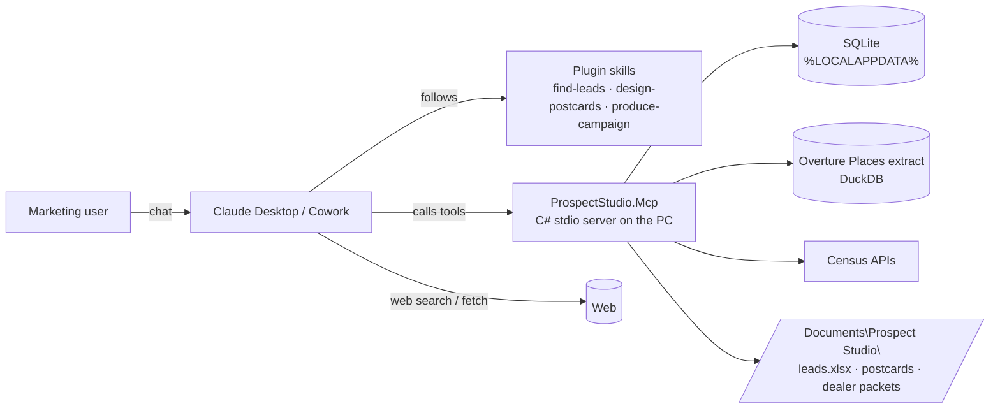

# POC Handoff: Prospect Studio (Claude-native)

**Status:** Ready to start, 2026-09-29 · **Owner:** Andy · **Builder:** Claude Code (supervised)

## What we're building

Phase 0.5 from the [PRD](../docs/01-PRD.md#8-scope-by-phase): a working proof of concept that a marketing user runs from **Claude Desktop / Cowork** on Windows.



- **Claude** does the judgment work: turning the brief into a search profile, researching the top leads on the web, writing copy, and designing postcard variants.
- The **MCP server** does the deterministic work: geography, market sizing, candidate search, dedupe, suppression, dealer routing, scoring, spreadsheet round-trip (Google Sheets / Excel compatible), rendering, tracking codes, packets and manifests.
- The **skills** tell Claude how to run each workflow, step by step, including what to confirm with the user.

## Reading order for Claude Code

1. [`../CLAUDE.md`](../CLAUDE.md): rules, stack, conventions
2. [`requirements.md`](requirements.md): what the POC must do, and the acceptance demo
3. [`technical-design.md`](technical-design.md): how it's structured
4. [`mcp-tools.md`](mcp-tools.md): the tool contracts
5. [`implementation-plan.md`](implementation-plan.md): chunks C0–C13; do them in order
6. [`agent-workflow.md`](agent-workflow.md): how the lead session uses the subagents in `.claude/agents/`
7. [`schemas/`](schemas/) and [`fixtures/`](fixtures/): use them in tests

Background (optional): [lead search strategy](../docs/03-Lead-Search-Strategy.md), [postcard generation](../docs/04-Postcard-Generation.md), [dealer routing & attribution](../docs/08-Dealer-Routing-and-Attribution.md), [mockup](../mockups/prospect-studio-mockup.html).

## Milestones

| Milestone | After chunk | What you can demo |
|---|---|---|
| **M0 · Engine alive** | C1 | Claude Code / MCP Inspector can call the server; campaigns persist |
| **M1 · Data works** | C5 | "Houston metro warehouses" → hundreds of candidates, dealer-assigned, customers suppressed |
| **M2 · Leads workbook** | C9 | In Cowork: brief → researched, scored `leads.xlsx`, edited in Google Sheets or Excel and re-imported |
| **M3 · Postcards** | C12 | Four variants in chat, edits, template, batch PDFs, proofs, dealer packets, manifest |
| **M4 · Measurement-ready** | C13 | Cohorts ("mail later" / A-B), warranty matchback report |

## Prerequisites (on Andy's Windows PC)

- Windows 11, Git, **.NET 10 SDK**, PowerShell 7 (for Playwright install), Node.js LTS (for MCP Inspector only)
- **Claude Code** (for building) and **Claude Desktop** with Cowork (for using)
- ~5 GB free disk (Overture extract for one state plus Census reference data)
- A spreadsheet app to review leads. **No Excel license needed:** Google Sheets with **Google Drive for desktop** (recommended), Excel for the web (free Microsoft account), or LibreOffice Calc. Optional chunk C8b adds a native Google Sheet (needs a Google Cloud OAuth client)
- **`CENSUS_API_KEY` is required** for market sizing (chunk C3), as an environment variable in the MCP server config. Since May 2026 every Census *data* query without one is refused with a redirect. It is free and arrives by email: `https://api.census.gov/data/key_signup.html`. Reference-data setup (C2) still works without it, because metadata and bulk file downloads are unkeyed.
- Optional keys: `MAPILLARY_TOKEN` and `GOOGLE_MAPS_API_KEY` (street-level reference imagery, C10). Stretch chunks: `OPENAI_API_KEY` or `GEMINI_API_KEY`, `HUBSPOT_TOKEN`, `LOB_API_KEY`

## Kickoff prompt (paste into Claude Code, in this folder)

After the first prompt installs the agent files, **restart Claude Code** (or open `/agents`) so it loads them before chunk C0.

```
First install poc/claude-config into .claude as described in its README and confirm the six
agent files exist. Then commit everything in the repo as the baseline. Read CLAUDE.md, then poc/README.md, poc/requirements.md, poc/technical-design.md,
poc/mcp-tools.md and poc/implementation-plan.md. Summarize your understanding of the POC
in 10 bullets and list any questions or contradictions you found. Then propose your plan
for chunk C0 only. Don't write code until I confirm.
```

For each later chunk, using the subagents in `.claude/agents/` ([agent-workflow.md](agent-workflow.md)):

```
Run chunk C<N> using poc/agent-workflow.md. First give me the plan: tests, file ownership,
whether api-verifier is needed. After I confirm: api-verifier (if needed) → test-engineer →
chunk-implementer → spec-reviewer (loop until ready) → mcp-smoke-tester. Then update the status
table and decisions log, commit, and tell me what I need to check by hand.
```

Without subagents (fine for small chunks):

```
Implement chunk C<N> from poc/implementation-plan.md. Follow CLAUDE.md. Start with a short
plan and the list of tests you'll write. When done: run all tests, update the status table
and decisions log in implementation-plan.md, and show me the manual check steps for this chunk.
```

## Assumptions (confirm or correct as they come up)

- Fictional fixtures stand in for real dealer territories, suppression lists and warranty data until the business provides them ([09 guide](../docs/09-Sales-Team-Discussion-Guide.md#7-what-wed-need-from-the-team)).
- The pilot geography is Texas / Houston metro. The code must handle any US state.
- The brand kit is a placeholder. The postcard look follows the mockup until real brand assets arrive.
- No paid data vendors in the POC. Open data (Overture, Census) plus Claude's web research.
- HubSpot, print-mail APIs and AI photo scenes are **stretch** chunks, not required for acceptance.
