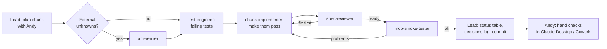
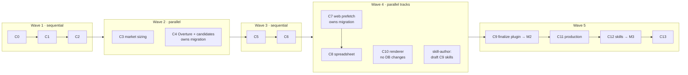

# Working with subagents (Claude Code)

**Version:** 0.1 · 2026-09-29

The main Claude Code session acts as the **lead**. It plans each chunk with you, delegates focused work to subagents, merges results, and keeps the status table and decisions log. Subagents are defined in `.claude/agents/*.md` (**install them first** from [`claude-config/`](claude-config/README.md)) and start with a clean context: their own instructions, `CLAUDE.md`, and the task the lead gives them. They don't see the chat history.

## Is it worth it?

Yes, for three reasons, with limited parallelism:

| Benefit | How |
|---|---|
| **Cleaner context** | The lead stays small and strategic; the test output, file reads and trial-and-error happen inside subagents, which return short summaries |
| **Independent quality gates** | Tests are written from the spec by someone other than the implementer, and a read-only reviewer checks rules and contracts |
| **Some parallel work** | A few chunk pairs don't touch the same files (see [Waves](#waves-what-can-run-in-parallel)) |

The costs: more tokens (each subagent re-reads its context), and parallel edits need **git worktrees** and merge discipline. Most chunks still run one after another because they build on each other.

## The agents

| Agent | Role | Edits files? | Model |
|---|---|---|---|
| **lead** (main session) | Plans with Andy, delegates, merges, updates the status table and decisions log, commits | Yes (docs, merges) | your session model |
| `api-verifier` | Checks external assumptions (V1–V8, URLs, schemas) with docs and throwaway spikes | `spikes/` only | sonnet |
| `test-engineer` | Writes failing tests + fixtures from the spec | Tests, fixtures, compile stubs | inherit |
| `chunk-implementer` | Makes the tests pass within its assigned scope | `src/` | inherit |
| `spec-reviewer` | Read-only review against rules, contracts, definition of done | No | opus |
| `mcp-smoke-tester` | Runs the chunk's manual check through the real MCP tools | No (inspects outputs) | sonnet |
| `skill-author` | Writes the plugin skills and keeps them in sync with the tool list | `plugin/` | opus |

Invoke them by name ("use the test-engineer to…") or with an @-mention (`@agent-spec-reviewer review the C4 changes`). The descriptions also let the lead delegate on its own. Nesting is disabled (`CLAUDE_CODE_MAX_SUBAGENT_SPAWN_DEPTH=1` in `.claude/settings.json`), so only the lead delegates.

## Per-chunk pipeline



1. **Plan (lead + Andy):** the lead summarizes the chunk, the tests, file ownership, and whether anything runs in parallel. Andy confirms.
2. **Verify (optional):** `api-verifier` for chunks with external unknowns (C0, C2, C3, C4, C9, C10). It can run at the same time as step 3 when the tests don't depend on the findings.
3. **Tests first:** `test-engineer` writes the chunk's tests and fixtures and confirms they fail for the right reason.
4. **Implement:** `chunk-implementer` makes them pass. For large chunks (C2, C4, C10, C11), the lead may split the work into two sequential implementer tasks (e.g., C10: layouts + scene builder, then renderer + QA).
5. **Review:** `spec-reviewer`. For fixes, the lead **resumes the same implementer** (SendMessage) so it keeps its context.
6. **Smoke test:** `mcp-smoke-tester` in the **foreground** (background subagents may not get MCP tools). After a rebuild, the lead may need `/mcp` to reconnect the server.
7. **Close out (lead only):** update the status table and decisions log in `poc/implementation-plan.md`, commit `C<N>: …` on the chunk branch, push it, and open a PR. Post the `spec-reviewer` findings (and how each was resolved) as a PR comment, so the review reasoning survives outside the chat. Then list what Andy must check by hand. **Andy approves and merges** — see [Branches, PRs and CI](#branches-prs-and-ci).

## Branches, PRs and CI

Each chunk from C1 onward is a branch (`c<N>-<slug>`, e.g. `c1-campaigns`) merged through a PR, not a direct push to `master`. This lines up with the worktrees the parallel waves already need.

**GitHub Actions** (`.github/workflows/ci.yml`) runs `dotnet build` and `dotnet test` on every PR, on **Windows**, in **both Debug and Release**. Both configurations matter: Release compiles out the `#if DEBUG` tools, so a Debug-only test file loses its coverage there silently — which is exactly what the C0 review caught. `Category=Network` tests are excluded, per `CLAUDE.md`.

CI is the gate that matters, because it is the one check an agent cannot satisfy by asserting it. "Tests pass" in a subagent's report is a *claim*; a green check is evidence. The lead still re-runs the suite locally before opening the PR.

**Only Andy approves and merges.** This is a constraint, not a preference:

- Every agent in this project runs under Andy's git and GitHub credentials, so a PR opened by the lead is authored by Andy's account.
- **GitHub refuses self-approval**, so a "reviewing subagent" literally cannot approve these PRs — and if it could, the approval would be Andy approving Andy, an audit trail that invites trust it hasn't earned.
- Therefore, when configuring branch protection on `master`, **require the CI status check but do not require approving reviews.** Requiring an approval would deadlock the repo: the only account that can approve is the author.

`spec-reviewer` remains the substantive review, and it still runs **pre-commit** against the working tree, so blockers never reach history. The PR is the durable record of that review, not a second gate.

Small chunks (C0, C1) can skip the separate test-engineer/implementer split: one implementer writes the tests and code, then the review runs as usual.

## Waves: what can run in parallel



| Wave | Parallel pair | Why it's safe | Ownership |
|---|---|---|---|
| 2 | **C3 ∥ C4** | C3 adds no tables (disk cache only) | C3: `Core/Market`, `Infrastructure/Census`, `Mcp/Tools/MarketTools`. C4: everything else, including **the only migration** |
| 4 | **C7 → C8 ∥ C10** | C10 adds no tables; C7/C8 don't touch rendering | C7/C8: `Web`, `Excel`, lead tools, **the only migration**. C10: `Rendering`, `Postcards`, `PostcardTools` |
| 4 | **Skill drafting ∥ code** | Skills only read `mcp-tools.md` | `skill-author`: `plugin/` only. Finalized in C9 against the real tool list |
| any after C8 | **C8b** (optional) | Separate Google store | Coordinate its migration (spreadsheet ID on the campaign) with whoever owns the wave's migration |

## Two things that bite in practice

**A running MCP server blocks builds.** `.mcp.json` points Claude Code at `src/ProspectStudio.Mcp/bin/Debug/net10.0/ProspectStudio.Mcp.dll`, which is exactly where builds write, so the connected dev server holds those DLLs open. The symptom is `MSB3026 … being used by another process … .NET Host (NNNN)` retrying up to ten times. **Disconnect the dev server before building** (that is the agreed resolution — we keep `.mcp.json` on `bin/Debug` as technical-design §2 specifies rather than adding a second copy). Claude Desktop's server runs from `dist/mcp`, so it does not block builds, but it *does* block `tools/publish-mcp.ps1`. Subagents must report the lock rather than killing processes; only the lead kills one, and only with Andy's say-so.

**A subagent does not survive a Claude Code restart.** Its file edits are on disk, but the agent itself is gone and `SendMessage` cannot resume it, whatever a task notification may imply. So: for any long subagent task, prefer committing its output at natural milestones, and when a session ends mid-run, inspect the working tree and relaunch a fresh agent with a brief that says what already exists and what remains. Do not assume the partial work is broken — check whether its tests fail for the right reason first.

**Rules for parallel work**
1. **Commit the baseline first.** Worktrees branch from the default branch, so uncommitted docs, fixtures and code are invisible to worktree agents. Commit before starting a wave.
2. **Run parallel implementers with worktree isolation.** Ask the lead to spawn them "in a worktree" (the Agent tool's `isolation: "worktree"`). Test-engineer and implementer for the same chunk share one worktree (run sequentially in it).
3. **One migration owner per wave.** EF Core migrations and the model snapshot conflict when two branches both add one. Only the named owner changes `ProspectDbContext` or adds migrations; the other track must not.
4. **Declared file ownership.** The lead tells each agent which folders it owns. Shared files (`Program.cs` DI registration, `.sln`, `Directory.Build.props`) are edited only by the lead during merge, or by one named agent.
5. **The lead merges one branch at a time:** merge, run `dotnet test`, and fix before merging the next.
6. **Only the lead edits** `poc/implementation-plan.md` (status table, decisions log) and `docs/`, which avoids merge conflicts in shared docs.
7. **At most 2–3 subagents at once.** More adds cost and merge risk without much speed.

## Prompts

**Start a chunk (sequential):**
```
Run chunk C<N> using poc/agent-workflow.md. First give me the plan: tests, file ownership,
whether api-verifier is needed. After I confirm: api-verifier (if needed) → test-engineer →
chunk-implementer → spec-reviewer (loop until ready) → mcp-smoke-tester. Then update the status
table and decisions log, commit, and tell me what I need to check by hand.
```

**Start a parallel wave:**
```
Commit the current baseline. Then run wave 2 per poc/agent-workflow.md: C3 and C4 in separate
worktrees, each with its own test-engineer → chunk-implementer. C4 owns the migration; C3 must
not touch ProspectDbContext. When both are done, review each with spec-reviewer, merge C4 first,
run tests, then merge C3, run tests, smoke-test both, update the status table and commit.
```

**Review only:**
```
@agent-spec-reviewer review the uncommitted changes for chunk C<N>.
```

## Housekeeping
- `.gitignore` (C0) should include `spikes/`, `.dev-workspace/`, `.dev-data/`, `.claude/settings.local.json`, `.claude/agent-memory-local/`, `dist/`, `*.db`. Anchor the data and output patterns to the repo root (`/dist/`, `/refdata/`, `/overture/`…): unanchored, `overture/` also matches `src/ProspectStudio.Infrastructure/Overture/`, and `core.ignoreCase` on Windows makes the match case-blind.
- `.github/workflows/ci.yml` runs the tests on every PR. Keep it in step with the solution when projects are added.
- The lead needs the **GitHub CLI** (`gh`) installed and authenticated to open PRs.
- `.claude/agents/` and `.claude/settings.json` are committed so they stay the same across machines.
- If an agent keeps making the same mistake, fix its `.md` instructions (or `CLAUDE.md`) rather than repeating the correction in chat.
