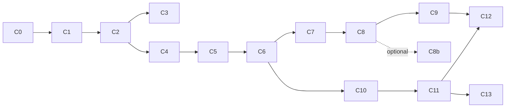

# POC Implementation Plan: testable chunks

**Version:** 0.1 · 2026-09-29

Work **one chunk at a time, in order**, except for the parallel waves described in [agent-workflow.md](agent-workflow.md), which also defines the subagent pipeline used for each chunk. Each chunk ends with green tests, a manual check, an updated status table and a commit. Sizes are rough: **S** ≈ 1 working session, **M** ≈ 1–2 sessions, **L** ≈ 2–4 sessions.

## Status

| Chunk | Title | Size | Status | Date | Notes |
|---|---|---|---|---|---|
| C0 | Skeleton & first tool | S | ☐ Not started | | |
| C1 | Workspace, SQLite, campaigns, profile | M | ☐ | | |
| C2 | Jobs, reference data, geography, NAICS | L | ☐ | | |
| C3 | Market sizing (Census CBP) | M | ☐ | | |
| C4 | Overture extract & candidate search | L | ☐ | | |
| C5 | Dealers, territories, suppression → **M1** | M | ☐ | | |
| C6 | Leads, scoring, research storage | M | ☐ | | |
| C7 | Website prefetch & features | M | ☐ | | |
| C8 | Spreadsheet round-trip (Excel & Google Sheets compatible) | M | ☐ | | |
| C8b | Native Google Sheets (optional; core if team is on Google Workspace) | M | ☐ | | |
| C9 | Plugin v0: setup + find-leads skills → **M2** | M | ☐ | | |
| C10 | Postcard renderer core | L | ☐ | | |
| C11 | Templates, codes, batch production | L | ☐ | | |
| C12 | Skills: design + produce → **M3** | M | ☐ | | |
| C13 | Cohorts & warranty matchback → **M4** | M | ☐ | | |
| S1–S6 | Stretch | — | ☐ | | |

Status values: ☐ Not started · ◐ In progress · ☑ Done · ⚠ Blocked (say why)

## Definition of done (every chunk)

- [ ] Code follows `CLAUDE.md` (layering, stdout rule, compact outputs, guardrails)
- [ ] Listed automated tests exist and pass: `dotnet test` (no network)
- [ ] Network tests (if any) pass when run explicitly, or are documented as skipped with the reason
- [ ] New tools match `mcp-tools.md` (names, inputs, outputs, errors); contract test updated
- [ ] Manual check performed and noted in the status table
- [ ] Decisions and deviations recorded at the bottom of this file
- [ ] Commit `C<N>: <title>`

---

## C0 · Skeleton & first tool (S)

**Goal:** a buildable solution and a stdio MCP server that Claude Code and Claude Desktop can call.

**Build**
- `src/ProspectStudio.sln` with `Core`, `Infrastructure`, `Mcp`, and three test projects ([technical-design §3](technical-design.md#3-solution-structure)); `Directory.Build.props`; `.editorconfig`; `.gitignore` (see [agent-workflow.md §Housekeeping](agent-workflow.md#housekeeping)). The git repo and GitHub remote already exist, so **commit the spec pack first** so that worktree-based subagents can see it.
- `PsOptions` from environment variables ([§4](technical-design.md#4-configuration)); creates `PROSPECT_STUDIO_DATA\logs`.
- Serilog to file + **stderr**. `Program.cs` with MCP stdio host and `WithToolsFromAssembly()`. When CLI arguments are present (`doctor`, later `setup`), run the verb instead of the server.
- Tool `get_status` (version, paths, keys configured as booleans; readiness fields present but `false` for now).
- `McpToolException` and the error mapping ([mcp-tools §Errors](mcp-tools.md#errors)).
- Debug-only tool `debug_sleep { seconds }` to measure client timeouts (V2), in its own `Mcp/Tools/DebugTools.cs` with the **whole file wrapped in `#if DEBUG`**, so it cannot reach a Release build.
- Root `.mcp.json` for Claude Code ([technical-design §2](technical-design.md#2-runtime-topology)).
- `tools/publish-mcp.ps1`: publishes **Release, win-x64, self-contained** to `dist/mcp`, then prints the ready-to-paste `claude_desktop_config.json` snippet (absolute exe path plus the `PROSPECT_STUDIO_HOME`, `PS_TRACKING_BASE_URL` and `CENSUS_API_KEY` env block from [technical-design §2](technical-design.md#2-runtime-topology)). Andy registers the server in Claude Desktop himself; the script never edits the Desktop config.

**Verify & record:** V1 (SDK API names), V2 (timeout observed in Claude Desktop), V3 (Claude Desktop sees the published exe).

**Automated tests**
- `Mcp.Tests`: start the server as a child process via the SDK's stdio client → `tools/list` contains `get_status` → call returns `version` and paths.
- A test that nothing is written to stdout except protocol messages (start the server, send `initialize`, assert every stdout line parses as JSON-RPC).
- `Core.Tests`: `PsOptions` defaults and env overrides.

**Manual check:** MCP Inspector lists and calls `get_status`; in Claude Code, `/mcp` shows `prospect-studio` connected; run `pwsh tools/publish-mcp.ps1`, paste the printed snippet into `claude_desktop_config.json`, and confirm Claude Desktop answers "What's the Prospect Studio status?".

---

## C1 · Workspace, SQLite, campaigns, profile (M)

**Goal:** campaigns persist; search profiles are validated and saved.

**Build**
- EF Core setup per [technical-design §5.3](technical-design.md#53-ef-core-usage-notes): `ProspectDbContext`, `AddDbContextFactory`, WAL/busy-timeout/foreign-keys interceptor, `MigrateAsync()` at startup and in `setup`. Tables are introduced **per chunk** through migrations (C1: `C1_Campaigns`). Core gets `ICampaignStore`; Infrastructure implements it with EF.
- Workspace bootstrap: create `Brand Kit`, `Dealers`, `Suppression`, `Templates`, `Campaigns` if missing. Copy `poc/fixtures/brand-kit` into `Brand Kit` **only** when it's empty and a `--seed-fixtures` flag / `PS_SEED_FIXTURES=1` is set (dev convenience).
- Tools: `create_campaign`, `list_campaigns`, `get_campaign`, `save_search_profile` (JsonSchema.Net with `poc/schemas/search-profile.schema.json` embedded; extra rule: `scoringWeights` must sum to 1.0 ± 0.001).
- Campaign folder name: `yyyy-MM <Name>` with invalid path characters removed; IDs `cmp_` + 6 characters.

**Automated tests**
- Migrations apply cleanly to a new temp SQLite file; applying again is a no-op; re-opening keeps data.
- **Model/migration drift guard:** `context.Database.HasPendingModelChanges()` is `false`, so a forgotten migration fails the build's tests. Keep this test for every later chunk.
- `create_campaign` creates a folder; a duplicate name → `CONFLICT`; a name with `/:*?"<>|` is sanitized.
- `save_search_profile`: `poc/fixtures/sample-search-profile.json` passes; missing `segments`, bad NAICS (`"23A"`) and weights summing to 0.9 each fail with JSON-pointer details.
- `get_campaign` returns zero counts for a new campaign.

**Manual check:** in Claude Code: "Create a campaign 'Houston test' and save poc/fixtures/sample-search-profile.json to it." Confirm the folder and `search-profile.json`.

---

## C2 · Jobs, reference data, geography, NAICS (L)

**Goal:** background jobs work; the server knows US geography and NAICS.

**Build**
- `JobRunner` ([§8](technical-design.md#8-jobs)) + `jobs` table + `get_job`, `list_jobs`, `cancel_job`.
- `prepare_data` (reference part) and CLI `setup --states TX`: counties → Parquet via DuckDB `spatial`; CBSA delineation; ZCTA↔county; skip steps already done; `refdata/manifest.json` with source URLs and dates.
- Commit `Infrastructure/Reference/naics2022.csv` (code, title, level) generated from the Census NAICS 2022 file; `lookup_naics` (token match + prefix boost).
- `resolve_geography` for state, county, CBSA/metro, ZIP list and radius (lat/lon; address via the Census geocoder). Return `alternatives` for ambiguous queries.
- **Test fixtures (generate once from the real files, commit):** `tests/Fixtures/geo/counties_houston.parquet` (9 Houston CBSA counties + Jefferson 48245, simplified geometry), `cbsa_excerpt.csv`, `zcta_county_excerpt.csv`.

**Verify & record:** V5 (Census URLs and years), V7 (DuckDB extensions on Windows).

**Automated tests**
- Job runner: progress updates; cancel; a job left `running` becomes `interrupted` after restart; completed steps skipped on re-run.
- `resolve_geography`: "Houston metro" → CBSA 26420 with exactly 48015, 48039, 48071, 48157, 48167, 48201, 48291, 48339, 48473; "Harris County, TX" → 48201; ZIP 77494 → its counties (multi-county ZCTA); a radius of 10 mi around downtown Houston (29.7604, −95.3698) → includes 48201; "Springfield" → `alternatives` populated.
- `lookup_naics("electrical contractor")` → 238210 in the top 3; `"warehouse"` → 4931/493110 in the top 3.
- Network (opt-in): download the real county file and CBSA file; row counts plausible (~3,200 counties).

**Manual check:** `setup --states TX` from the terminal; then in Claude Code, "Resolve 'Houston metro' and 'Harris County'".

---

## C3 · Market sizing (M)

**Goal:** `estimate_market` gives establishment counts before any search.

**Build**
- `CensusCbpClient`: discover the latest available CBP year (probe `https://api.census.gov/data/<year>/cbp` downward from last year) and the NAICS variable name via `variables.json`; query per state with a county list; employee-size breakdown (`EMPSZES`); disk cache for 30 days; optional `CENSUS_API_KEY`.
- `estimate_market` ([contract](mcp-tools.md#estimate_market)): sums by NAICS and in total; `withMinEmployees` sums the size classes at or above the threshold; notes suppressed or missing cells.

**Verify & record:** V5 (variable names, size-class codes and labels).

**Automated tests** (recorded JSON fixtures, no network)
- Sums across counties and NAICS codes are correct; the size-class threshold picks the right classes (e.g., 20+ = 20–49 and up).
- Suppressed/missing values are handled, with a note added.
- A multi-state geography triggers one query per state.
- Network (opt-in): live query for Harris County, NAICS 4931, returns > 0.

**Manual check:** "How many warehousing (4931) and electrical contractor (238210) establishments are in the Houston metro, and how many have 20+ employees?"

---

## C4 · Overture extract & candidate search (L)

**Goal:** real candidate companies from Overture, stored with provenance and deduplicated.

**Build**
- `prepare_data` / `setup`: Overture per state ([§6.1](technical-design.md#61-setup-pipeline-setup-cli-verb-and-prepare_data-tool--job)). Record `DESCRIBE` output (V6) in the decisions log.
- Tables: `companies`, `sites`, `source_records`, `leads` (partial: identity, status, features placeholder).
- `lookup_overture_categories` (counts from the extract, cached).
- `find_candidates` ([contract](mcp-tools.md#find_candidates)): spatial join to counties, first address/website/phone, `name_norm`, dedupe ([§7.1–7.2](technical-design.md#7-algorithms)), idempotent re-runs, compact summary.
- **Fixture:** build `tests/Fixtures/places/sample_places.parquet` from `poc/fixtures/sample-places.csv` with a small DuckDB script (committed). **Once the real taxonomy is known, update the category names in `sample-places.csv` and `sample-search-profile.json` to real ones.**

**Verify & record:** V6 (schema, taxonomy values, address/region formats).

**Automated tests** (fixture Parquet + fixture counties)
- Houston CBSA scope returns fixture places in the 9 counties and **excludes** the Beaumont (Jefferson County) rows.
- The confidence threshold excludes rows < 0.6.
- Category OR keyword matching works (a place matched only by a name keyword is included).
- Dedupe: fixture duplicate pairs (same domain; same name within 150 m) collapse to one lead each and are marked `duplicate`.
- A re-run with the same inputs creates no new rows.
- Bulk insert of 5,000 synthetic candidates via the EF batching path completes in < 10 s on a temp DB (guards against per-row `SaveChanges`).
- Name normalizer: 20+ table cases ("The Bayou Fulfillment Co., LLC" → "bayou fulfillment"; "Gulf Coast Sign & Lighting" → "gulf coast sign and lighting").

**Manual check:** after `setup --states TX`, in Claude Code: "Find warehouse and electrical-contractor candidates in the Houston metro for campaign 'Houston test'." Note the time (target < 30 s) and the counts.

---

## C5 · Dealers, territories, suppression (M) → **M1**

**Goal:** every candidate is routed to a dealer (or flagged as a gap), and existing customers and dealers are removed.

**Build**
- Tables: `dealers`, `dealer_branches`, `territories`, `suppression`.
- `import_list` for `dealers`, `territories`, `suppression` (CSV and XLSX; row errors reported), and `list_dealers`.
- `resolve_geography` type `dealer`.
- `assign_dealers` ([§7.4](technical-design.md#74-territory-assignment)) and `apply_suppression` ([§7.3](technical-design.md#73-suppression)); `find_candidates` now runs both automatically; `get_status` shows counts.

**Automated tests** (fixtures `dealers.csv`, `territories.csv`, `suppression.csv`, sample places)
- Pasadena (77506) → `bay` via a ZIP override despite Harris defaulting to `gulf`; Katy (77494) → `gulf`; Conroe (Montgomery) → `pine`; Galveston → `bay`.
- A lead in a county with no territory → `assignment=gap`.
- The dealer names and the customer domain in `suppression.csv` are suppressed with the right reasons; the fuzzy variant "Coastal Crane and Rigging" matches "Coastal Crane & Rigging LLC" in the same ZIP.
- Manual overrides survive `assign_dealers` re-runs.
- An import with a bad `dealer_id` in territories reports the row number and imports the rest.

**Manual check (M1 demo):** import the fixtures → find Houston candidates → counts by dealer, gaps and suppression reasons look right.

---

## C6 · Leads, scoring, research storage (M)

**Goal:** Claude can browse leads compactly, save validated research, and get explainable scores.

**Build**
- Tables: `research`, `signals`; full `leads` columns.
- `list_leads`, `get_lead`, `update_leads`, `score_leads`, `save_research` ([contracts](mcp-tools.md#leads)).
- `FeatureExtractor` + `Scorer` per [§7.6](technical-design.md#76-scoring-deterministic); `score_breakdown_json`.

**Automated tests**
- Table-driven scorer tests, including: no signals → max 75 (never tier A); the three worked examples in [docs/03 §8](../docs/03-Lead-Search-Strategy.md#8-worked-example-illustrative-fictional-companies), with fixture research, land in tiers A, A, B.
- Weights override validated (sum 1.0).
- `save_research`: `poc/fixtures/sample-research-valid.json` accepted and re-scored; each case in `sample-research-invalid.json` rejected with a precise message (missing URL, bad date, personal line > 180 chars, adjustment 20).
- `list_leads` with 25 rows serializes to < 16 KB; paging `total` correct; filters combine correctly.
- `update_leads` sets `assignment=override` when the dealer changes.

**Manual check:** in Claude Code, research one real lead with web search, `save_research`, and see the score change with a breakdown.

---

## C7 · Website prefetch & features (M)

**Goal:** cheap, polite enrichment for hundreds of candidates.

**Build**
- `WebFetcher`: robots.txt (cached per host, honors `Disallow`/`Allow` for our UA and `*`), 4 concurrent, 1 req/s per host, 10 s timeout, ≤ 5 redirects, 1 MB cap, disk cache; `TextExtractor` (AngleSharp); "about" page discovery; keyword features.
- Table: `web_pages`. Job `prefetch_websites` (resumable; skips fetched unless `refetch`); rescoring afterwards (decide: automatic or explicit; record it).

**Automated tests** (in-process fake HTTP handler; no network)
- robots.txt: disallowed path not fetched and counted as `robotsBlocked`; UA-specific group respected.
- Rate limiting per host with a fake clock; concurrency ≤ 4.
- Text extraction from 3 saved HTML fixtures (nav/footer/script removed; excerpt ≤ 4,000 chars).
- Facility keyword counting (case-insensitive, whole words; "sq. ft." and "square feet" both count).
- Job resumes after cancellation without refetching.

**Manual check:** run on 50 real Houston candidates; spot-check 5 excerpts; confirm the log shows no robots violations.

---

## C8 · Spreadsheet round-trip: Excel & Google Sheets compatible (M)

**Goal:** the marketer reviews the leads in Google Sheets, Excel (desktop or free web) or LibreOffice; edits flow back.

**Build**
- `ILeadSheetStore` + `XlsxLeadSheetStore`; `export_leads_workbook` and `import_leads_workbook` per [§9](technical-design.md#9-workbook-leadsxlsx), following the **compatibility profile** (§9.1) and **tolerant import rules** (§9.2), including `.csv` import; `FILE_LOCKED` detection.
- A `ReadMe` sheet with the three no-API workflows from §9.3.

**Automated tests**
- Export: sheets present (Leads, Evidence, Lists, Summary, ReadMe); header row frozen; `LeadId` visible in col A; `Status` inline list validation; `Dealer` validation points at `Lists`; URLs shown as text and hyperlinked; tier fills static.
- **Compatibility lint:** a test opens the exported file and fails if it finds any Excel Table (ListObject), conditional-format rule, merged cell in the data area, formula in a data column, macro part, pivot table, or non-ASCII sheet name.
- Round-trip: change 3 statuses, 1 dealer (by name), 2 notes, 1 contact with ClosedXML → import → DB matches, and the change summary counts are exact.
- Tolerance: columns reordered, an extra user column added, `LeadId` hidden, status typed as `approved`/`Yes` → still imported correctly; a CSV export of the Leads sheet imports the same changes.
- **Real-app fixtures:** import `tests/Fixtures/workbooks/leads_saved_by_google_sheets.xlsx` (and `…_libreoffice.xlsx` if available) and get the expected changes. Andy creates these once: export the fixture campaign, edit it in Google Sheets as described in the fixture README, download as .xlsx, and commit.
- An unknown dealer name → warning, no change; an unknown `LeadId` → listed; non-editable column edits → ignored.
- File open with `FileShare.None` → `FILE_LOCKED`.
- 1,000-lead export < 10 s.

**Manual check:** open `leads.xlsx` from Google Drive in Google Sheets (edit as .xlsx), approve 5, change one dealer; let Drive sync; import via Claude Code. Repeat once with a CSV download.

---

## C8b · Native Google Sheets (M, optional; promote to core if the team works in Google Workspace)

**Goal:** leads live in a real Google Sheet, with no file shuffling.

**Build**
- `GoogleLeadSheetStore` per [§9.4](technical-design.md#94-native-google-sheets-optional-chunk-c8b): OAuth desktop flow (`drive.file`), token storage via DPAPI, and tools `connect_google` (starts the browser consent and reports the connected account), `publish_leads_sheet` and `pull_leads_sheet`. The spreadsheet ID and URL are stored on the campaign; `get_campaign` shows them.
- Config: `PS_GOOGLE_CLIENT_SECRET_PATH` (the downloaded OAuth client JSON) and an optional `PS_GOOGLE_DRIVE_FOLDER_ID`.
- The `find-leads` skill offers "Google Sheet or Excel file?" when both are configured.

**Automated tests**
- Mapping from the lead model to Sheets API batch requests (values, validation, frozen row, fills) is unit-tested against recorded request JSON, with no network.
- Pull uses the same §9.2 import rules (shared tests, run against a fake `ISheetsClient`).
- Network (opt-in): publish the fixture campaign to a test Drive folder, edit one cell through the API, pull, and verify the change.

**Manual check:** connect with Andy's Google account; publish; edit in Sheets; pull. Confirm the token still works after a restart and note the consent-screen status (Internal / Testing / Published).

---

## C9 · Plugin v0: setup + find-leads skills (M) → **M2**

**Goal:** a non-developer can run lead finding end to end in Cowork.

**Build**
- `plugin/prospect-studio/` ([§11](technical-design.md#11-skills-plugin)): `plugin.json` (v0.1.0), `README.md` (publish exe; register it in Claude Desktop config; install the plugin in Cowork; set env vars), skills `setup-workspace` and `find-leads` with references (`scoring-rubric.md` from §7.6, `research-checklist.md`, `lift-equipment-segments.md` using **real** Overture categories found in C4, `profile-examples.md` with the Houston profile).
- Script `tools/package-plugin.ps1` → `dist/prospect-studio.plugin` (zip).

**Verify & record:** V3 (Cowork sees the tools through Claude Desktop's bridge); whether a plugin-bundled `.mcp.json` works on Windows (optional).

**Automated tests**
- Skill lint test: every SKILL.md has `name` + `description` frontmatter, the body is < 2,500 words, and every backticked tool name in the skill exists in the server's `tools/list`.
- `claude plugin validate plugin/prospect-studio/.claude-plugin/plugin.json` passes (run in CI script or manually).

**Manual check (M2 demo):** run [requirements §6](requirements.md#6-acceptance-demo-poc-is-done-when-this-runs-end-to-end) steps 1–7 in Cowork. Record duration, rough token use, and any points where Claude hesitated or misused a tool; refine the skill text, then run once more.

---

## C10 · Postcard renderer core (L)

**Goal:** Claude can render and see personalized postcard previews; print output is correct and license-safe.

**Build**
- Layouts (4 fronts + 1 back) per [§10.1](technical-design.md#101-layouts), styled after `mockups/prospect-studio-mockup.html`.
- `MergeContext`, sandboxed Fluid (Liquid), `SceneBuilder` (SVG + product cutout), `QrService` (QRCoder → SVG/PNG data URI), `PlaywrightRenderer` (preview PNG, print PDF, email PNG; network blocked), QA checks ([§10.5](technical-design.md#105-qa-checks-run-in-the-page-via-js-returned-as-qafinding)), asset sidecar enforcement.
- Tools: `get_brand_kit`, `list_layouts`, `render_postcard_preview` (returns image content + QA JSON; saves to `previews/`).
- Brand kit fixture: add Barlow and Barlow Condensed TTFs (SIL OFL) to `poc/fixtures/brand-kit/fonts/` with their license file, or document the fallback fonts.

**Verify & record:** V4 (images display in Claude Desktop/Cowork), V8 (Playwright on Windows).

**Automated tests**
- Spec validation: `sample-postcard-spec.json` valid; unknown layout / slot / scene value rejected.
- Merge: missing `contact.firstName` falls back to the default; a missing required field → `merge-missing` QA error.
- Overflow: a 140-character headline in `hero-bold-left` → `overflow` error; the normal headline → no errors.
- Print PDF: 2 pages, each 666 × 450 pt (9.25 × 6.25 in) via PdfPig.
- QR in the rendered PNG decodes (ZXing) to `<base>?code=<code>` (use a fixed test code).
- An asset without `print` in `allowedUses` → `LICENSE_BLOCKED` for print; preview allowed with a warning.
- No outbound network requests during render (Playwright route counter).
- Clear-zone check fires when a test layout places text in the USPS zone.

**Manual check:** in Claude Desktop, "Show me the bold hero layout for lead L0001 front and back". The image appears, and the QA list is empty.

---

## C11 · Templates, tracking codes, batch production (L)

**Goal:** from one approved design to a complete, mailable file set.

**Build**
- Tables: `templates`, `tracking_codes`, `renders`.
- Tools: `save_template`, `list_templates`, `get_template`, `set_lead_overrides`, `assign_tracking_codes` ([§7.7](technical-design.md#77-tracking-codes)), `render_campaign` (job; per-lead print PDF + email PNG; `proofs.pdf`; `qa-report.xlsx`; `onlyFlagged`), `build_dealer_packets` (job; [§10.6](technical-design.md#106-dealer-packets)), `export_mailing_manifest`.

**Automated tests**
- Code generator: 10,000 codes, all 6 characters, from the alphabet, unique; assignment idempotent; URL built with a `{code}` placeholder and with appended `?code=`.
- `render_campaign` over the 12 fixture leads: 12 PDFs + 12 PNGs with the expected file names; `proofs.pdf` has 24 pages; the QA report flags the long-name fixture lead; `onlyFlagged` re-renders just those.
- Overrides apply to one lead only.
- Dealer packets: one folder per dealer present in the approved set; PDF page count = that dealer's leads; the XLSX has an Outcome dropdown.
- Manifest: columns per contract; one row per approved lead; the file paths exist.

**Manual check:** open `proofs.pdf` and one dealer packet; scan a QR code with a phone.

---

## C12 · Skills: design-postcards + produce-campaign (M) → **M3**

**Goal:** the marketer designs and produces a campaign through conversation.

**Build**
- Skills `design-postcards` (references: `copy-guidelines.md` from [docs/04 §8](../docs/04-Postcard-Generation.md#8-copy-guidelines-tone-guardrails), `imagery-rules.md` from [docs/04 §5](../docs/04-Postcard-Generation.md#5-imagery-sources--licensing-read-this-first), `spec-cheatsheet.md`) and `produce-campaign`; plugin v0.2.0.

**Automated tests:** skill lint (as in C9).

**Manual check (M3 demo):** full [acceptance demo](requirements.md#6-acceptance-demo-poc-is-done-when-this-runs-end-to-end) steps 1–11 in Cowork, timed. Record the results against the success criteria.

---

## C13 · Cohorts & warranty matchback (M) → **M4**

**Goal:** the campaign is measurable from day one.

**Build**
- `assign_cohorts` ([§7.8](technical-design.md#78-cohorts)); the manifest gains `Cohort` and excludes `holdout` and later waves from the current mailing (reported as `excluded`).
- `import_list kind=warranty`; tables `warranty`, `matches`; `run_matchback` ([§7.9](technical-design.md#79-warranty-matchback)) → `reports/attribution.xlsx` (Summary by cohort, Matches, Review queue).
- Skill `measure-campaign`.

**Automated tests**
- The same seed gives identical cohorts; a different seed gives different ones; per-stratum proportions within ±1 lead; cohorts locked after a render unless `force`.
- Matchback with `warranty-sample.csv` against the fixture leads: exact 1, strong 2, fuzzy 1 (`needs_review`), and the pre-mail purchase ignored.

**Manual check:** assign "mail later" + personalized/generic on the demo campaign; run matchback with the fixture warranty file; open `attribution.xlsx`.

---

## Stretch chunks (optional, any order after C12)

| ID | Chunk | Acceptance |
|---|---|---|
| S1 | **AI photo scenes** (`generate_scene_image` via OpenAI or Gemini image API behind `IImageGenerator`): building-type scene, no people or logos, product composited from the cutout afterwards; sidecar `{source:"ai-generated", license:"owned-by-prompter", allowedUses:[screen,email,print]}` | 10 scenes generated; the product is never AI-drawn; license sidecar present; cost per image logged |
| S2 | **Google Places verification** (`verify_places`): `businessStatus`, store `place_id` only | Closed businesses flagged; DB audit shows no Places names/addresses stored |
| S3 | **HubSpot sync** (`hubspot_sync_campaign`, `hubspot_pull_responses`): companies upsert with `ps_*` properties; form submissions by `code` | 15 companies in the HubSpot sandbox; a test submission pulled back and attached to the lead |
| S4 | **Lob test mode** (`send_postcards_test`): create postcards from the manifest in test mode; store Lob IDs | Test postcards visible in the Lob dashboard; tracking events pulled |
| S5 | **Bulk LLM light pass** (`classify_candidates` via the Anthropic API, small model, JSON output) for large candidate sets | 800 candidates classified < 10 min; cost logged; agreement with Claude's deep research on 25 leads ≥ 80% |
| S6 | **Permit signals** (Houston/Harris open-data permits → `signals`) | Permits matched to leads by address; appear as cited signals |

---

## Decisions made during implementation

Add entries here as you go (date · chunk · decision · reason).

| Date | Chunk | Decision | Reason |
|---|---|---|---|
| 2026-09-29 | pre-C0 | Lead spreadsheet is a **Google-Sheets-compatible `.xlsx`** (compatibility profile, tolerant import); native Google Sheets is optional chunk C8b | Andy has no Excel license; the file must work in Google Sheets, Excel web and LibreOffice; the team's platform is still unknown |
| 2026-09-29 | pre-C0 | Use **EF Core 10** (SQLite provider, code-first migrations) instead of Dapper + hand-written SQL | Andy's preference and team familiarity; matches the desktop app architecture (docs/02); migrations and LINQ projections keep the schema evolvable across chunks |
