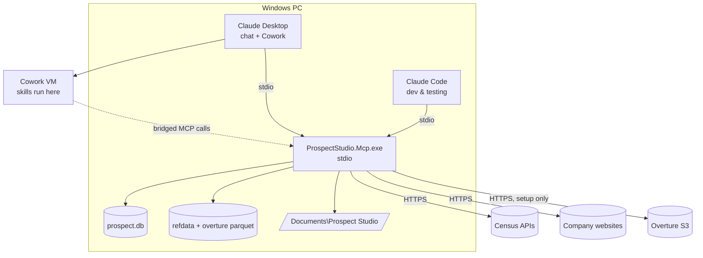

# POC Technical Design: Prospect Studio (Claude-native)

**Version:** 0.1 · 2026-09-29 · Companion to [requirements.md](requirements.md) and [mcp-tools.md](mcp-tools.md)

---

## 1. Principles

1. **Claude judges, the engine computes.** Anything deterministic (geography, counts, dedupe, routing, scoring math, files) lives in C#. Anything needing judgment (profile design, research, copy, design choices) is done by Claude, guided by skills, and saved through tools that **validate** it.
2. **State lives in SQLite and files, not in the chat.** Tools return summaries and IDs; Claude pages through data when needed.
3. **Reusable core.** `ProspectStudio.Core` and `ProspectStudio.Infrastructure` must not reference MCP. The future desktop app calls the same services.
4. **Compliance by construction.** License metadata on every asset, provenance on every record, robots.txt respected, no Google imagery path in the code.
5. **Verify external assumptions early.** URLs, schemas and client behaviors below are best current knowledge; each chunk says what to verify first.

## 2. Runtime topology



- **Registration for users:** add the server to Claude Desktop's `claude_desktop_config.json` (stdio). Claude Desktop bridges local servers into Cowork sessions. *Verify in C9* that the tools appear in Cowork. Also note the known Windows MSIX quirk where "Edit Config" can open a different config file than the one the app actually loads.
- **Plugin:** ships **skills only** for the POC. The MCP server is registered separately, because a plugin-bundled stdio server may run inside the Cowork VM where a Windows exe can't run. *Verify in C9*; bundle it later if supported.
- **Registration for development:** project `.mcp.json` in the repo root for Claude Code, pointing at the built DLL (not `dotnet run`, which can write build output to stdout):

```json
{
  "mcpServers": {
    "prospect-studio": {
      "command": "dotnet",
      "args": ["src/ProspectStudio.Mcp/bin/Debug/net10.0/ProspectStudio.Mcp.dll"],
      "env": { "PROSPECT_STUDIO_HOME": "./.dev-workspace", "PROSPECT_STUDIO_DATA": "./.dev-data" }
    }
  }
}
```

**User config example** (`claude_desktop_config.json`):

```json
{
  "mcpServers": {
    "prospect-studio": {
      "command": "C:\\Tools\\ProspectStudio\\ProspectStudio.Mcp.exe",
      "env": {
        "PROSPECT_STUDIO_HOME": "C:\\Users\\<user>\\Documents\\Prospect Studio",
        "PS_TRACKING_BASE_URL": "https://example.com/lp?code={code}",
        "CENSUS_API_KEY": ""
      }
    }
  }
}
```

## 3. Solution structure

```
src/
├─ ProspectStudio.sln
├─ Directory.Build.props              # net10.0, Nullable, LangVersion, warnings
├─ ProspectStudio.Core/               # domain + services + interfaces (no I/O libs)
│  ├─ Domain/                         # Campaign, Site, Company, Lead, Dealer, Branch, Territory, Signal, Template, TrackingCode, Job…
│  ├─ Profiles/                       # SearchProfile model + validation wrapper
│  ├─ Geography/                      # GeoScope, IGeographyResolver
│  ├─ Candidates/                     # CandidateService, Deduper, NameNormalizer, SuppressionMatcher
│  ├─ Routing/                        # TerritoryAssigner
│  ├─ Scoring/                        # FeatureExtractor, Scorer, ScoringWeights
│  ├─ Research/                       # ResearchService (validate + persist + rescore)
│  ├─ Tracking/                       # CodeGenerator, CohortAssigner
│  ├─ Matchback/                      # WarrantyMatcher
│  ├─ Postcards/                      # PostcardSpec, MergeContext, TemplateService, QaFinding
│  ├─ Jobs/                           # IJobRunner, JobState
│  └─ Abstractions/                   # IRepository interfaces, IClock, IFileStore, IWebFetcher, ICensusClient, IPlacesStore, IRenderer, IWorkbookService
├─ ProspectStudio.Infrastructure/
│  ├─ Storage/                        # EF Core: ProspectDbContext, entity configurations, repositories, Migrations/
│  ├─ Reference/                      # Census downloads, CBSA/ZCTA parsing, NAICS table
│  ├─ Overture/                       # DuckDB extract + queries
│  ├─ Census/                         # CBP client with response cache
│  ├─ Web/                            # WebFetcher (robots, rate limit), TextExtractor (AngleSharp)
│  ├─ Excel/                          # ClosedXML workbook export/import, dealer XLSX
│  ├─ Rendering/                      # Fluid (Liquid) templates, SceneBuilder (SVG), QrService, PlaywrightRenderer, Layouts/*
│  ├─ Jobs/                           # Channel-based JobRunner persisted in SQLite
│  └─ Config/                         # EnvironmentOptions: reads the real process environment,
│                                     # resolves absolute paths, creates the data directories.
│                                     # The PsOptions record and its pure binder live in Core
│                                     # (Core/Configuration) so Core stays I/O-free — see C0 decisions
├─ ProspectStudio.Mcp/
│  ├─ Program.cs                      # host, DI, stdio transport, CLI verbs (setup, doctor)
│  ├─ Tools/                          # one class per tool group: SetupTools, CampaignTools, GeoTools, CandidateTools, LeadTools, WorkbookTools, PostcardTools, ProductionTools, MeasureTools
│  └─ Errors/                         # McpToolException → structured error
└─ tests/
   ├─ ProspectStudio.Core.Tests/
   ├─ ProspectStudio.Infrastructure.Tests/     # includes Category=Network live tests
   └─ ProspectStudio.Mcp.Tests/                # in-process MCP client contract tests
plugin/prospect-studio/                         # skills (C9, C12, C13)
poc/fixtures/, poc/schemas/                     # copied into test output as content
```

**NuGet (initial):** `ModelContextProtocol`, `Microsoft.Extensions.Hosting`, `Microsoft.EntityFrameworkCore.Sqlite`, `Microsoft.EntityFrameworkCore.Design` (dev only, for `dotnet ef`), `DuckDB.NET.Data.Full`, `ClosedXML`, `Microsoft.Playwright`, `QRCoder`, `JsonSchema.Net`, `AngleSharp`, `Fluid.Core`, `Serilog.Extensions.Hosting`, `Serilog.Sinks.File`, `Serilog.Sinks.Console` (stderr), `F23.StringSimilarity` (Jaro-Winkler) or a small in-house implementation. Tests: `xunit`, `Shouldly`, `UglyToad.PdfPig`, `ZXing.Net` (decode QR in tests).

## 4. Configuration

| Variable | Default | Purpose |
|---|---|---|
| `PROSPECT_STUDIO_HOME` | `%USERPROFILE%\Documents\Prospect Studio` | User-facing workspace (brand kit, dealers, templates, campaigns) |
| `PROSPECT_STUDIO_DATA` | `%LOCALAPPDATA%\ProspectStudio` | `prospect.db`, `refdata\`, `overture\`, `cache\`, `logs\` |
| `PS_TRACKING_BASE_URL` | `https://example.com/lp?code={code}` | QR/short URL target; `{code}` placeholder, or `?code=` appended |
| `PS_OFFER_PREFIX` | from brand kit, else `LIFT` | Printed offer code prefix |
| `PS_USER_AGENT` | `ProspectStudioBot/0.1 (+mailto:marketing@example.com)` | Web fetch identity |
| `PS_IMAGERY_PROVIDER` | `streetview` | Street-level reference imagery: `streetview`, `mapillary` or `none`. The other configured provider is the fallback when the preferred one has no coverage |
| `MAPILLARY_TOKEN` | none | Mapillary client token; enables the `mapillary` provider |
| `PS_OVERTURE_RELEASE` | discovered latest, else `2026-09-23.1` | Overture release to extract |
| `PS_CBP_YEAR` | discovered latest available | Census CBP dataset year |
| `CENSUS_API_KEY` | none | **Required for `estimate_market` (C3).** Since May 2026 every Census *data* query without a key returns HTTP 302 to `missing_key.html` with header `X-DataWebAPI-KeyError: 1`. Metadata (`…/variables.json`) still works unkeyed, which is what the CBP year probe uses. Free from `https://api.census.gov/data/key_signup.html`, emailed |
| Stretch: `OPENAI_API_KEY`, `GEMINI_API_KEY`, `GOOGLE_MAPS_API_KEY`, `HUBSPOT_TOKEN`, `LOB_API_KEY`, `ANTHROPIC_API_KEY` | none | Only read by stretch chunks |

## 5. Storage

### 5.1 File layout

```
%LOCALAPPDATA%\ProspectStudio\
├─ prospect.db
├─ refdata\  counties.parquet (geometry), cbsa.csv, zcta_county.csv, naics2022.csv (bundled copy), manifest.json
├─ overture\<release>\places_<ST>.parquet
├─ cache\census\*.json, cache\web\<hash>.html
└─ logs\prospect-YYYYMMDD.log

Documents\Prospect Studio\
├─ Brand Kit\ brand.json, logo.svg, fonts\*.ttf, products\*.png|svg (+ *.asset.json)
├─ Dealers\ dealers.csv, territories.csv
├─ Suppression\ *.csv|xlsx
├─ Templates\ <slug>.json, <slug>.png
└─ Campaigns\<yyyy-mm> <Name>\
   ├─ search-profile.json
   ├─ leads.xlsx
   ├─ previews\*.png
   ├─ postcards\print\L0001_<Company>.pdf, postcards\email\L0001_<Company>.png, postcards\proofs.pdf, postcards\qa-report.xlsx
   ├─ dealers\<Dealer>\lead-packet.pdf, leads.xlsx
   ├─ mailing\manifest.csv
   └─ reports\attribution.xlsx
```

### 5.2 SQLite schema (first cut; EF Core code-first, migrations in `Infrastructure/Storage/Migrations/`)

| Table | Key columns |
|---|---|
| `__EFMigrationsHistory` | Managed by EF Core |
| `campaigns` | id (`cmp_` + 6 chars), name, slug (unique; duplicate detection, case-insensitive), product, notes, folder_path, status, profile_json, profile_saved_at, geo_json, **scoring_weights_json** (the effective weights of the last `score_leads` run, so `save_research` re-scores on the same scale), created_at, updated_at |
| `dealers` | id, name, website, alert_email, logo_file |
| `dealer_branches` | id, dealer_id, name, address, city, state, zip, lat, lon, phone, tracking_phone |
| `territories` | id, dealer_id, branch_id, level (`zip`/`county`), code, priority |
| `suppression` | id, company_name, name_norm, domain, address_norm, zip, reason (`customer`/`dnc`/`dealer`/`competitor`/`other`), source_file |
| `companies` | id, name, name_norm, domain |
| `sites` | id, company_id, overture_id (unique), name, address, city, state, zip, county_fips, lat, lon, phone, website, taxonomy_primary, taxonomy_path, basic_category, confidence, release |
| `source_records` | id, site_id, source, source_id, retrieved_at, license, payload_json |
| `leads` | (campaign_id, id `L0001`), site_id, status (`candidate`,`suppressed`,`duplicate`,`review`,`approved`,`rejected`,`hold`), suppression_reason, **suppression_id** (which suppression row matched, so a suppression can be explained), **pre_suppression_status** (the status suppression took the lead from, so releasing it gives that status back instead of silently spending an `approved`; null for a lead that has never been suppressed), dealer_id, branch_id, assignment (`auto`/`override`/`gap`), features_json, score, tier, score_breakdown_json, research_status (`none`/`saved`/`no_signal`), notes, contact_name, contact_title, cohort, updated_at |
| `web_pages` | site_id, url, fetched_at, http_status, robots_allowed, text_excerpt (≤ 4,000 chars), keywords_json |
| `research` | campaign_id, lead_id, research_json, llm_adjustment, saved_at |
| `signals` | id, campaign_id, lead_id, type, text, url, date |
| `templates` | id, name, slug, spec_json, thumbnail_path, created_at |
| `tracking_codes` | code (PK), campaign_id, lead_id, url, created_at, unique(campaign_id, lead_id) |
| `renders` | campaign_id, lead_id, template_id, pdf_path, png_path, qa_json, rendered_at |
| `jobs` | id, kind, campaign_id, status (`queued`,`running`,`succeeded`,`failed`,`interrupted`,`cancelled`), progress, message, params_json, result_json, **created_at**, started_at, finished_at |
| `warranty` | id, registration_id, serial, model, customer_name, name_norm, address_norm, zip, purchase_date, dealer_id, promo_code |
| `matches` | campaign_id, lead_id, warranty_id, tier (`exact`/`strong`/`fuzzy`), status (`confirmed`/`needs_review`/`rejected`) |

### 5.3 EF Core usage notes

- **Layering:** `ProspectDbContext` and all `IEntityTypeConfiguration<T>` mappings live in `Infrastructure/Storage`. Core defines repository/store interfaces (`ICampaignStore`, `ILeadStore`…); Infrastructure implements them with EF. Core has no EF package reference, so the desktop app can reuse it unchanged.
- **Context lifetime:** register `AddDbContextFactory<ProspectDbContext>`. MCP tools and job steps create a short-lived context per operation (`await using var db = await factory.CreateDbContextAsync(ct)`). Never share a context across concurrent jobs.
- **Startup:** `Database.MigrateAsync()` on server start and in the `setup` CLI verb. On connection open, run `PRAGMA journal_mode=WAL; PRAGMA busy_timeout=5000; PRAGMA foreign_keys=ON;` (via a `DbConnectionInterceptor`).
- **Migrations:** one or more per chunk, named `C<N>_<Description>` (e.g., `C1_Campaigns`, `C4_SitesAndLeads`). Never edit a migration after it's committed; add a new one. SQLite limits some `ALTER TABLE` operations, and EF rebuilds the table in those cases. Review the generated migration before committing.
- **Keys:** `Lead` has a composite key (`CampaignId`, `Id`); string IDs (`cmp_…`, `L0001`, tracking codes) are generated in Core, not by the database.
- **JSON columns:** `profile_json`, `features_json`, `score_breakdown_json`, `research_json`, `spec_json`, etc. are stored as TEXT. Map them either with `OwnsOne(...).ToJson()` where the shape is stable (e.g., `ScoreBreakdown`), or with a `ValueConverter` using `System.Text.Json` for opaque documents (profile, spec, research). Filtering happens on real columns (status, tier, score, dealer), never inside JSON.
- **Bulk writes:** `find_candidates` and `prefetch_websites` can write thousands of rows. Use batches of ~500 per `SaveChangesAsync`, with `ChangeTracker.AutoDetectChangesEnabled = false` during the batch and a fresh context per batch. For set-based updates (re-scoring, dealer assignment, suppression), use `ExecuteUpdateAsync`/`ExecuteDeleteAsync`. Target: 5,000 candidates stored in < 10 s.
- **Reads for tools:** `AsNoTracking()` and projection to compact DTOs (`Select(...)`) for `list_leads`, `get_campaign` and similar, so tool responses stay small and fast.
- **Concurrency:** single user, so there's no optimistic concurrency token in the POC. Background jobs and tool calls can overlap; WAL mode plus short transactions keeps SQLite locking manageable. Retry once on `SQLITE_BUSY`.
- **Dates:** a model-level convention (`ConfigureConventions`) maps every `DateTimeOffset` to a UTC `DateTime` via `UtcDateTimeOffsetConverter`. **Do not revert this to the provider's default converter** — that default keeps the offset suffix, and EF then refuses `ORDER BY` on the column ("convert the values to a supported type"), which breaks any dated list. The conversion is provider-agnostic and correct on SQL Server and PostgreSQL too, so it is a portability improvement rather than a SQLite workaround. Domain types in Core still expose `DateTimeOffset`. Storage is UTC throughout; the only human-facing local time is the campaign folder name, which is computed and never persisted. Revisit only if a chunk needs to store a genuine local offset (e.g. a dealer-local mail date).
- **Wire format:** tool JSON serializes timestamps as `yyyy-MM-ddTHH:mm:ssZ` through a converter on the shared serializer options, not as `+00:00` with fractional seconds, which matches the examples in [mcp-tools.md](mcp-tools.md) and keeps paged lists compact.
- **Portability:** SQLite is the target for 1 user or several users with separate data. If 2–5 users later need **shared** campaigns and leads, move to a database server (Azure SQL/SQL Server preferred, PostgreSQL acceptable) by swapping the EF provider, creating a new baseline migration and running a one-off data copy. Don't put the SQLite file on a network share or OneDrive. The provider-neutral rules in `CLAUDE.md` keep this move cheap. Overture/Census reference data stays in local DuckDB/Parquet either way.

## 6. Reference data & Overture

### 6.1 Setup pipeline (`setup` CLI verb and `prepare_data` tool → job)
1. **NAICS 2022** table: committed as `Infrastructure/Reference/naics2022.csv`, generated once from the Census NAICS file.
2. **County boundaries** (verified in C2): `https://www2.census.gov/geo/tiger/GENZ2025/shp/cb_2025_us_county_500k.zip` (11.7 MB, 3,235 rows). Probe the year downward from the current one — 2026 is not published yet. `ST_Read` **cannot open the zip directly**; use the GDAL virtual path with forward slashes:

```sql
LOAD spatial;   -- required on EVERY new connection, not just at install
COPY (SELECT GEOID, NAME, STATEFP, geom AS geometry
      FROM ST_Read('/vsizip/C:/…/cb_2025_us_county_500k.zip/cb_2025_us_county_500k.shp'))
TO 'counties.parquet' (FORMAT PARQUET);
```

The geometry column from `ST_Read` is `geom` (lowercase); the attribute columns are uppercase VARCHAR. Geometry round-trips through Parquet as WKB and reads back as `GEOMETRY('EPSG:4269')` — NAD83, close enough to WGS84 here. Note `ST_Point` takes **(lon, lat)**.

3. **CBSA delineation** (verified in C2): `https://www2.census.gov/programs-surveys/metro-micro/geographies/reference-files/2023/delineation-files/list1_2023.xlsx` → `cbsa.csv`. It is an **`.xlsx`, not a CSV** (read it with ClosedXML, already in the stack): rows 1–2 are a title, **row 3 is the header**, and trailing rows are notes or blank. State and county FIPS are **separate** string columns (`'48'`, `'015'`) that must be concatenated into a 5-digit GEOID. ~1,915 data rows. 2023 is the newest — 2024 onward 404, so this file is effectively frozen.
4. **ZCTA ↔ county** (verified in C2): `https://www2.census.gov/geo/docs/maps-data/data/rel2020/zcta520/tab20_zcta520_county20_natl.txt` → `zcta_county.csv`. **Pipe-delimited with a UTF-8 BOM**, ~47,860 rows. Columns are `GEOID_ZCTA5_20` and `GEOID_COUNTY_20`. **Rows with an empty ZCTA exist** (counties containing none) and must be filtered out.
5. **Overture Places per state:** DuckDB with `httpfs` + `spatial`; anonymous S3 in `us-west-2`:

```sql
INSTALL httpfs; LOAD httpfs; INSTALL spatial; LOAD spatial;
SET s3_region='us-west-2';
COPY (
  SELECT id, names.primary AS name, basic_category, taxonomy, confidence,
         websites, phones, addresses, geometry, bbox
  FROM read_parquet('s3://overturemaps-us-west-2/release/{release}/theme=places/type=place/*', hive_partitioning=1)
  WHERE bbox.xmin BETWEEN {minx} AND {maxx} AND bbox.ymin BETWEEN {miny} AND {maxy}
) TO '{out}/places_{ST}_bbox.parquet' (FORMAT PARQUET);
-- then narrow to the state (see below) and write places_{ST}.parquet
```

**Verified against release `2026-09-23.1` in C4.** Anonymous S3 works with no credentials. The column list above runs unchanged. Overture **removed the `categories` column**: use `taxonomy` STRUCT(`primary` VARCHAR, `hierarchy` VARCHAR[], `alternates` VARCHAR[]) and `basic_category`. `taxonomy.primary` is the leaf and the last element of `hierarchy`; `basic_category` is a coarser rollup and often *not* the leaf. `bbox` is STRUCT(xmin, xmax, ymin, ymax), so bbox pre-filtering works. Discover the latest release from `https://stac.overturemaps.org/catalog.json` (`latest` field).

**Do not clip to the state polygon.** `ST_Within` against a `ST_Union_Agg` of the county geometries took **149 s**; filtering `addresses[1].region = 'TX'` takes **1 s** and keeps 1,622,773 rows versus 1,630,017 from the polygon — a rounding difference against a 150× cost. The county join at query time ([§6.3](#63-candidate-query-local-parquet)) does the precise spatial work anyway.

**`addresses` is a list of structs** — STRUCT(freeform, locality, postcode, region, country)[] — but its maximum length in Texas is 1, so `addresses[1]` is safe. Fields are `.freeform` (street), `.locality` (city), `.postcode`, `.region`, `.country`. **Region is plain `TX`, not `US-TX`.** Postcodes are sometimes ZIP+4 (`77064-3335`) so normalize to the first 5; `phones` and `websites` are flat `VARCHAR[]` with inconsistent formatting (`7137477411`, `17136884530`, bare `http://`), and a large share of rows have no website at all.

**Scale:** the Texas bbox extract takes ~70 s for 2.19M rows / 275 MB (the bbox spills into Oklahoma and Mexico); narrowing to Texas leaves ~1.62M rows / ~205 MB. Hence `prepare_data` is a background job, while candidate search over the local file is a few seconds.

### 6.2 Geography resolution
`resolve_geography` returns a `GeoScope`:

```json
{ "type": "cbsa", "label": "Houston-Pasadena-The Woodlands, TX", "cbsa": "26420",
  "states": ["TX"], "countyFips": ["48015","48039","48071","48157","48167","48201","48291","48339","48407","48473"],
  "zips": [], "radius": null, "bbox": [-96.6, 28.8, -94.3, 30.7] }
```

- **state:** by name or abbreviation → all counties.
- **county:** "Harris County, TX" → FIPS 48201.
- **cbsa / metro:** fuzzy title match on the CBSA file ("Houston metro" → 26420).
- **zip list:** ZIPs → counties via ZCTA file (for the bbox); the candidate filter uses the address postcode.
- **radius:** lat/lon (or an address via the Census geocoder) + miles → the counties intersecting the circle; the filter uses distance.
- **dealer:** `dealer:<id>` (or `{type:"dealer", values:["gulf"]}`) → union of its territory ZIPs and counties. **The ZIP rules are also expanded into their counties**, because the Parquet query filters by county: without that, a dealer whose claim on a county is purely by ZIP (as `bay` is on Harris) would have those ZIPs unsearchable. The ZIPs stay in `zips` so the precise postcode filter still applies. An unknown dealer id is `NOT_FOUND`.

### 6.3 Candidate query (local Parquet)

```sql
LOAD spatial;   -- required on EVERY connection
SELECT p.*, c.GEOID AS county_fips
FROM read_parquet('{overture}/places_TX.parquet') p
JOIN (SELECT GEOID, ST_SetCRS(geometry, 'OGC:CRS84') AS geometry
      FROM read_parquet('{refdata}/counties.parquet')) c
  ON ST_Within(p.geometry, c.geometry)
WHERE c.GEOID IN ({countyFips})
  AND p.confidence >= {minConfidence}
  AND ( list_has_any(p.taxonomy.hierarchy, {categories}) OR p.taxonomy.primary IN ({categories})
        OR regexp_matches(lower(p.name), {keywordRegex}) )
```

**The `ST_SetCRS` is not optional.** Overture geometry is `OGC:CRS84` while the Census counties Parquet is `EPSG:4269`, and DuckDB raises a Binder error on `ST_Within` across mismatched CRS. Aligning the *county* side is the cheap fix; the two datums are equivalent for our purposes. Test fixtures must reproduce the same CRS pairing, or the tests pass while real data throws.

Verified in C4: this join runs in ~2 s over the full 1.6M-row Texas file (437,396 places across the eleven fixture counties), and the category and name filters add ~0.6 s — so the under-30 s target in C4 is comfortable. Note `p.name` is the alias created by §6.1's `names.primary AS name`.

Prefer **specific `taxonomy.primary` values over broad ones**: `contractor` has ~19k Texas rows and `manufacturer` ~17k via hierarchy, so wide categories destroy precision.

## 7. Algorithms

### 7.1 Name normalization
Lowercase → `&`→`and` → **remove** punctuation (not replace with space, so `L.L.C.` → `llc` and `O'Brien` → `obrien`) → strip legal suffixes → collapse whitespace. Unit-test with 20+ cases.

**Position matters, and the original "remove these tokens anywhere" wording was wrong.** Stripping `co` wherever it appears turns `CO Industries` into `industries`, losing the distinguishing word. So:

- **`the` is stripped only in leading position.**
- **Legal suffixes are stripped only in trailing position**, repeatedly: `inc`, `incorporated`, `llc`, `ltd`, `co`, `corp`, `corporation`, `company`, `lp`, `llp`, `pllc`.

That still satisfies the mandated cases — `The Bayou Fulfillment Co., LLC` → strip leading `the`, then trailing `llc`, then trailing `co` → `bayou fulfillment`; `Gulf Coast Sign & Lighting` → `gulf coast sign and lighting` — while leaving `CO Industries` → `co industries` intact.

### 7.2 Dedupe (within a campaign)
1. **Domain key:** registrable domain of the website, ignoring generic hosts (`facebook.com`, `instagram.com`, `linkedin.com`, `yelp.com`, `google.com`, `business.site`, `wixsite.com`, `godaddysites.com`, `squarespace.com`, `sites.google.com`). "Registrable" is the last two labels after dropping `www.`, plus a short exception list for multi-label public suffixes (`co.uk`, `com.au`, `co.nz`, `com.br`). A full public-suffix list is out of scope for the POC; every fixture domain is single-label, so the exception path is deliberately narrow.
2. **Name + place key:** `name_norm` + geohash-7. This is a cheap **blocking key, not a guarantee** — two points 15 m apart can fall in adjacent cells (`9vk11mq` vs `9vk11mw`), so this rule alone misses them and rule 3 is the real safety net. Don't widen it with neighbour-cell lookups; rule 3 already covers the gap.
3. **Fuzzy:** Jaro-Winkler ≥ 0.92 on `name_norm` within 200 m. (The plan's "same name within 150 m" refers to this rule's window, which is 200 m.)

Rule 3 needs a spatial blocking grid to avoid a cross join. **State the invariant, not the constant: a grid cell must be wider than the 200 m window** so a ±1-cell neighbour scan cannot miss a qualifying pair. A cell size fixed in *degrees* satisfies this only up to a latitude — 0.005° of longitude is ~482 m at 30°N but only ~178 m at 71°N, where a qualifying pair two cells apart would be silently missed. Either widen the longitude scan by `ceil(200 m / cellMetres(lat))`, or assert the invariant so a future northern territory fails loudly instead of quietly under-merging.

Keep the highest-confidence record as the lead. Mark the others `duplicate` and keep their source records.

**Dedupe is transitive:** if A matches B by domain and B matches C by name, all three collapse into one group. Treat the matches as edges and take connected components — pairwise handling would make the result depend on row order, so the same input could yield different leads on a re-run, breaking idempotency (NFR-3).

### 7.3 Suppression
A lead is suppressed if any suppression row matches by **domain**, by **exact `name_norm`** (with the same ZIP when the row has one), or by **fuzzy name ≥ 0.92 with the same ZIP**. Store the reason and the matching row id. Dealers and competitors are suppression reasons like any other.

**Suppression is reversible, and reversing it must not discard a decision.** When a lead is suppressed, record the status it was suppressed from in `pre_suppression_status`; when the list stops naming it, restore that status rather than resetting to `candidate`. An already-suppressed lead keeps what it remembers, so repeated runs cannot erode it. Without this, adding a `dnc` row and later removing it silently destroys an approval.

**The ZIP requirement on the fuzzy rule is unconditional** — a suppression row with no ZIP never fuzzy-matches. Read that literally and deliberately: a false suppression silently deletes a real prospect, which is worse than a missed one, so an unanchored fuzzy name match is not worth the risk.

### 7.4 Territory assignment
ZIP5 match (`level=zip`) wins; otherwise county FIPS (`level=county`). Ties: lowest `priority`, then the nearest branch (haversine). No match → `assignment=gap`, `dealer_id=null`. Manual overrides (`update_leads`, workbook) set `assignment=override` and are never overwritten by re-assignment.

### 7.5 Website features (light enrichment job)
- Fetch the homepage, and one "about" link if found (anchor text or path matching `about|company|who-we-are`). Respect robots.txt (cache per host), 10 s timeout, max 4 concurrent requests and 1 request/s per host, max 1 MB per response. Cache raw HTML by URL hash.
- Extract visible text (AngleSharp; drop script/style/nav/footer) → excerpt ≤ 4,000 chars.
- Count **facility keywords** (profile `facilityKeywords`, default: `warehouse, distribution center, fulfillment, high-bay, dock, loading dock, racking, mezzanine, manufacturing, fabrication, plant, facility, square feet, sq ft, crane, installation, overhead, ceiling, aerial, lift`) and **segment keywords** (from the profile).
- Record `websiteReachable`, `httpStatus`, `robotsAllowed`.

### 7.6 Scoring (deterministic)

| Feature | How it's computed (0–1) | Default weight |
|---|---|---|
| `segmentFit` | Taxonomy match to a segment's categories = 1.0; name keyword = 0.8; website keyword = 0.6; otherwise 0.2 | 0.25 |
| `sizeFit` | From research `employeeEstimate` vs the **applicable minimum** — the matched segment's `minEmployees` when that segment sets one, otherwise the profile's `size.employeesMin`: ≥ min = 1.0; ≥ 50% of min = 0.5; below = 0.1; unknown = 0.5 | 0.15 |
| `facilityFit` | **Research wins when present**: `facilityFit.level` `high` = 1.0, `medium` = 0.75, `low` = 0.5, `unknown` = 0.4. Otherwise from distinct facility keywords in the website text: 0 = 0.2, 1 = 0.5, 2 = 0.75, ≥ 3 = 1.0; no website text = 0.4 | 0.20 |
| `signals` | **Buying** signals (`permit`, `hiring`, `expansion`, `news`, `funding`, `contract`; not `registry`/`other`) inside the **recency window** below: 0 = 0, 1 = 0.6, ≥ 2 = 1.0 | 0.25 |
| `proximity` | Distance to the assigned branch: ≤ 25 mi = 1.0, ≤ 50 mi = 0.6, farther = 0.3, no dealer = 0 | 0.05 |
| `confidence` | 0.7 × Overture confidence + 0.3 × (website reachable) | 0.10 |

**Why research outranks keywords for `facilityFit`:** the research schema carries a `facilityFit.level` that this table originally ignored, and the two readings are not interchangeable. Scoring the [worked examples](../docs/03-Lead-Search-Strategy.md#8-worked-example-illustrative-fictional-companies) both ways settles it — Westpark Metal Fab reaches its documented **71 B** only with the research level (`high` = 1.0); the keyword path gives it 59, a C. Keyword-derived facility evidence also does not exist until C7 fetches websites, so in C6 the research level is the only signal available at all. The level scale is deliberately aligned to the keyword scale so a lead's score does not jump when enrichment later arrives.

**The recency window.** A buying signal counts when its date falls in one of the **twelve calendar months ending with the current month** — truncate both the signal date and “now” to year-month and require a difference of **0–11 whole months**. Two consequences are deliberate. The reference instant comes from the injected `TimeProvider`, never wall time, and is recorded as `asOf` in `score_breakdown_json`, because a score that silently depends on when it ran cannot be explained later (and a fixture signal would quietly age out of a passing test suite). Month granularity keeps the two date precisions the schema allows interchangeable: `signals[].date` admits `YYYY-MM` as well as `YYYY-MM-DD`, and a day-precise window would score `2025-10` differently depending on whether it were read as the 1st or the 31st. A **future-dated** signal (a negative difference) does **not** count — a date later than today is far more often a typo or a mis-transcribed citation than a genuine filed-for-later project, and crediting it would let a bad date inflate a score.

**The tier-A guard is enforced, not merely arithmetic.** The base caps at 75 with no signals, but `llmAdjustment` is applied afterwards, so +5 would reach 80 and +15 would reach 90 — tier A on no cited evidence whatsoever, reached through precisely the subjective nudge the guard exists to contain. So a lead with **zero qualifying buying signals is capped at 79** (the top of tier B) however large its adjustment; negative adjustments always apply in full. The cap is `min(score, 79)` and **only ever lowers a score, never sets one** — worked example 3 has a `registry` signal and no qualifying one, and already scores 71, so reading the rule as “zero signals → 79” would *raise* it and break its documented number. “Qualifying” means what the scorer actually credits, so a lead whose only signals are `registry`, stale or future-dated is capped just the same as one with no signals at all. `score_breakdown_json` records when the cap bound, so a capped score is explainable rather than merely lower than expected.

Rounding is **away from zero** at a midpoint, stated because .NET's `Math.Round` default is banker's rounding and would otherwise make 79.5 land on 80 or 80.5 on 80 depending on the digit before it.

`score = clamp(round(100 × Σ wᵢ·fᵢ) + clamp(llmAdjustment, −15, +15), 0, 100)`. Tiers: **A ≥ 80, B ≥ 65, C < 65**. Without research signals the base maxes out at 75, so **tier A requires cited evidence**, which is intentional. Weights can be overridden in the profile (`scoringWeights`) and must sum to 1.0. `score_breakdown_json` stores each feature, weight and contribution so Claude can explain any score. Stored feature values and contributions are **rounded to 4 decimal places**, since the score is computed from full precision and a reader of the explanation should not meet `0.08000000000000002`. The score itself is never computed from the rounded values.

### 7.7 Tracking codes
CSPRNG; 6 characters from `23456789ABCDEFGHJKLMNPQRSTUVWXYZ` (32^6 ≈ 1.07 billion); unique across the `tracking_codes` table, retrying on collision. URL: replace `{code}` in `PS_TRACKING_BASE_URL`, otherwise append `?code=`. Printed offer code: `<prefix>-<code>`. Assignment is idempotent: an existing code for (campaign, lead) is reused.

### 7.8 Cohorts
Designs (combinable, applied in order): `mailLater {waves: 2, split: [50,50]}`, `holdout {pct: 15}`, `ab {variants: ["A","B"], split: [50,50]}`. Stratify by (tier, dealer); inside each stratum, order by `SHA256(seed + leadId)` and allocate proportionally. The cohort label is a path such as `wave1/A` or `holdout`. Deterministic for a given seed; re-running with the same seed returns identical results. Existing cohorts are locked once any render exists (unless `force`).

### 7.9 Warranty matchback
Normalize warranty rows the same way (name, address, ZIP).
- **exact:** `promo_code` equals the lead's code.
- **strong:** `name_norm` and ZIP equal, or normalized address equal.
- **fuzzy:** Jaro-Winkler ≥ 0.90 with the same ZIP → `needs_review`.

Window: `mail_date ≤ purchase_date ≤ mail_date + windowDays` (default 365). The report compares cohorts: leads, matched purchases, rate, plus the review queue.

## 8. Jobs
- An in-process `JobRunner` (`Channel<JobRequest>`, max 2 concurrent) persists state in `jobs` and reports progress roughly every 2 s.
- Kinds: `prepare_data`, `prefetch_websites`, `render_campaign`, `build_dealer_packets`.
- On startup, any job still `running` **or `queued`** becomes `interrupted`. The queue is in-memory, so after a restart a `queued` row has nothing left to run it and would otherwise sit at `queued` forever. Every job is safe to re-run (it skips completed items), so the recovery is always "run it again".
- Tools: `get_job`, `list_jobs`, `cancel_job`.

## 9. Workbook (`leads.xlsx`)

The file must work the same in **Google Sheets** (opened from Drive, including editing the `.xlsx` directly without converting it), **Excel for the web** (free with a Microsoft account), **desktop Excel** and **LibreOffice Calc**. The user may not have an Excel license.

| Sheet | Contents |
|---|---|
| **Leads** | `LeadId` (visible col A, grey, header "LeadId (don't edit)"), Status (dropdown: Review/Approve/Reject/Hold), Score, Tier, Company, Segment, Address, City, ZIP, Dealer (dropdown), Branch, Coverage gap, Top signal, Rationale, Suggested angle, Website, Contact name, Contact title, Notes. Frozen header row, AutoFilter, static fill by tier |
| **Evidence** | LeadId, Company, Type, Claim, Date, Source URL |
| **Lists** | Dealer names (source for the Dealer dropdown) and status values. Visible, last tab |
| **Summary** | Profile summary, geography, counts by status/tier/dealer, suppression counts by reason, generated time |
| **ReadMe** | Which columns are editable, how to edit in Google Sheets / Excel / LibreOffice, how to re-import |

### 9.1 Compatibility profile (use only features that survive all four apps)

| Use | Avoid |
|---|---|
| Plain ranges with AutoFilter | Excel "Tables" (ListObjects) and structured references |
| **Static** cell fills for tier colors | Conditional formatting (icon sets and data bars don't survive; keep it static) |
| Data validation **lists**: inline for Status (`Review,Approve,Reject,Hold`); a range on the visible `Lists` sheet for Dealer | Validation formulas, cross-workbook references, hidden validation sources |
| Frozen top row; column widths; wrap text | Merged cells in data areas; sheet/cell protection (Sheets ignores it; editable columns are enforced by the importer instead) |
| Hyperlinks set on cells **and** the URL shown as the cell text | Link-only cells where the visible text differs from the URL (the URL is lost if the link is dropped) |
| Dates written as ISO text (`2026-07-15`); numbers as numbers | Locale-dependent date formats; formulas in data columns |
| Arial or Calibri, a single font | Custom or theme fonts |
| Sheet names ASCII, ≤ 31 chars; ≤ 50,000 rows | Macros (`.xlsm`), pivot tables, slicers, sparklines, charts |

### 9.2 Import rules (tolerant by design)
- Editable columns: Status, Dealer (matched by dealer name or id), Contact name, Contact title, Notes. All other columns are ignored.
- **Columns are matched by header text** (case-insensitive, trimmed), not position, so moved, hidden or added columns don't break the import. The `LeadId` header is required.
- Status values are case-insensitive, with synonyms (`Approved`/`Yes` → Approve, `Rejected`/`No` → Reject). Blank means unchanged.
- Accepts `.xlsx` saved by Google Sheets (download as .xlsx, or Office-mode editing), Excel for the web, desktop Excel and LibreOffice. It also accepts a **`.csv` export of the Leads sheet** as a fallback.
- Extra rows without a `LeadId` are reported and ignored. Unknown LeadIds are reported. The workbook wins for editable columns, and the result includes a change log.

### 9.3 Ways the user can work with the file (no API needed)
1. **Google Drive for desktop:** put the `Prospect Studio` workspace (or just `Campaigns`) in a Drive-synced folder. Open `leads.xlsx` from Drive in Google Sheets and edit it **as .xlsx** (Office editing). Changes save back to the same file, Drive syncs it down, and `import_leads_workbook` reads it.
2. **Upload / download:** upload to Sheets, edit, then File → Download → Microsoft Excel (.xlsx) into the campaign folder (or `.csv`), then import.
3. **Excel for the web** (free Microsoft account, file in OneDrive) or **LibreOffice Calc** (free, local).

A native Google Sheet (created and read through the Google Sheets API) is chunk **C8b**; see [§9.4](#94-native-google-sheets-optional-chunk-c8b).

### 9.4 Native Google Sheets (optional chunk C8b)
- Abstraction: `ILeadSheetStore` with `XlsxLeadSheetStore` (C8) and `GoogleLeadSheetStore` (C8b). Both expose `PublishAsync(campaign)` and `PullEditsAsync(campaign)` and share the same column model and import rules (§9.2).
- Google Sheets API v4 + Drive API via `Google.Apis.Sheets.v4` / `Google.Apis.Drive.v3`, with an **OAuth desktop (loopback) flow** and the narrow **`drive.file`** scope (the app can only see files it created). Tokens are stored per user with DPAPI (Windows Credential Manager).
- `publish_leads_sheet` creates or updates one native Sheet per campaign in a Drive folder: same tabs, dropdowns via `setDataValidation`, frozen header, tier fills. It stores the spreadsheet ID on the campaign and returns the URL. `pull_leads_sheet` reads the Leads tab and applies §9.2.
- **Setup cost:** a Google Cloud project, an OAuth client (Desktop app type) and a consent screen. If the account is a Google **Workspace** org, use the *Internal* audience with no verification. With a personal Gmail account, an app left in *Testing* status gets refresh tokens that **expire after 7 days**, so the user would have to re-authorize weekly. Publish the app to avoid that (verification isn't normally required for non-sensitive scopes like `drive.file`).
- **Not used for this:** moving hundreds of rows through Claude's Google Drive connector in chat. It works for tiny lists, but it's slow and uses a lot of context.

## 10. Postcard rendering

### 10.1 Layouts
`Infrastructure/Rendering/Layouts/<layoutId>/` contains `layout.html` (Liquid, rendered with Fluid), `layout.css` and `layout.json` (slots, types, `maxChars`, allowed styles, default theme). The POC set follows the mockup:

| Layout | Side | Description |
|---|---|---|
| `hero-bold-left` | front | Full-bleed scene; dark gradient left; big headline + tagline; logo top-right |
| `photo-band-bottom` | front | Scene top ~65%; white band with headline, tagline, CTA pill |
| `spec-panel-left` | front | Navy panel left 42% with headline + 3 spec bullets; scene right |
| `dusk-centered` | front | Dusk scene; bottom gradient; centered headline, tagline, CTA |
| `letter-address` | back | Left: greeting, personal line, benefits, offer box (QR + code + URL), dealer card. Right: indicia, address block, clear zone |

### 10.2 Spec → HTML
1. Validate the spec against `schemas/postcard-spec.schema.json`, and check each slot against its layout's `maxChars` after merging.
2. Build the `MergeContext`: `company`, `site`, `lead` (incl. `personalLine`, `suggestedAngle`), `dealer`, `branch`, `campaign` (headline defaults, tagline, benefits, incentive, cta), `brand`, `tracking` (`code`, `offerCode`, `url`, `qrDataUri`), `contact` (name/title with defaults).
3. Render slot values with **Fluid** (Liquid syntax, e.g. `{{ contact.name | default: 'Facilities Manager' }}`), sandboxed: member access on the merge context only, and only the filters `default`, `upcase`, `downcase`, `capitalize`, `truncate`, `truncatewords`. Then render the layout.
4. Hero: `SceneBuilder` returns an SVG (see 10.3), embedded inline.
5. Fonts from `Brand Kit\fonts` via `@font-face` with file URLs. **No network requests during render** (block them in Playwright).

### 10.3 Scene builder (license-safe hero)
Parameters: `buildingType` (`warehouse`, `plant`, `shop`, `office`, `campus`), `signText` (defaults to the company short name), `timeOfDay` (`day`, `dusk`), `productId`, `productPosition` (`left`, `center`, `right`), `productScale` (0.6–1.4). Draws sky, ground, building (panels, dock doors, sign) in SVG like the mockup, then places the **product cutout** (`products/<id>.png|svg` from the brand kit) with an ellipse shadow. Asset metadata for the scene is `{source: "generated-illustration", license: "owned", allowedUses: ["screen","email","print"]}`.

### 10.4 Output
- Playwright Chromium, loading `file://` HTML from a temp folder with assets copied in.
- **Print PDF:** 2 pages (front, back), each **9.25 × 6.25 in** (6×9 trim + 0.125 in bleed), `PrintBackground=true`, zero margins.
- **Email PNG:** front only, cropped to trim, 1200 × 800.
- **Preview PNG:** front and/or back at 1200 px wide, returned as MCP image content (keep it ≤ ~400 KB).
- **Proofs:** one HTML document with all cards → `proofs.pdf`.

### 10.5 QA checks (run in the page via JS, returned as `QaFinding[]`)
| Check | Rule | Severity |
|---|---|---|
| `overflow` | Any `[data-slot]` text element with `scrollHeight > clientHeight + 1` or `scrollWidth > clientWidth + 1` | error |
| `safe-zone` | Text bounding box closer than 0.25 in to the page edge (0.125 in inside trim) | error |
| `merge-missing` | Merge field resolved to empty with no default | error |
| `clear-zone` | Any element intersects the back's USPS clear zone rectangle | error |
| `max-chars` | Slot text longer than the layout's `maxChars` | warning |
| `contrast` | Text vs declared background color contrast < 4.5:1 | warning (S) |
| `asset-license` | Any asset without `print` in `allowedUses` when rendering print | error (blocks print) |

### 10.6 Street-level reference imagery (`IStreetImageryProvider`)

Lets the user see what a lead's site actually looks like, so the sales team can judge whether a real photograph is worth commissioning. **Reference only — never print.**

- Abstraction `IStreetImageryProvider` in `Core/Postcards` with `FindAsync(lat, lon, heading?, ct)` returning image bytes plus provenance, and a `CoverageAsync` probe where the provider offers a cheap one. Implementations live in `Infrastructure/Imagery`:
  - **`GoogleStreetViewProvider`** — Street View Static API, keyed by `GOOGLE_MAPS_API_KEY`. Call the free `…/streetview/metadata` endpoint first to check coverage without spending a request.
  - **`MapillaryImageryProvider`** — keyed by `MAPILLARY_TOKEN`. Needs a spatial search for images near the coordinate ranked by distance and bearing, and often finds nothing useful outside dense urban areas, so it is the harder of the two to implement well.
- `PS_IMAGERY_PROVIDER` picks the preferred provider (default `streetview` for coverage); the other configured provider is the fallback on a miss. `none` disables the feature and the tool returns `UNSUPPORTED`.
- The image is saved to `campaigns\<campaign>\reference\<LeadId>_<provider>.jpg` with a sidecar:

```json
{ "source": "google-streetview", "license": "google-maps-platform-tos",
  "allowedUses": ["screen"], "attribution": "© Google",
  "retrievedAt": "2026-10-02T14:05:00Z", "lat": 29.7604, "lon": -95.3698, "heading": 210 }
```

Mapillary's sidecar uses `"license": "CC-BY-SA-4.0"` and the contributor's attribution string. **Both get `allowedUses: ["screen"]`** — Street View because its terms forbid print and promotional use, Mapillary because share-alike would arguably propagate to the postcard artwork. §10.5's `asset-license` check therefore blocks either from print and email output, which is the enforcement point; nothing relies on a person remembering the rule.

- Provenance (provider, URL, retrieval time, coordinates) is recorded so a later photographer brief can say exactly which view was being looked at.

### 10.7 Dealer packets
HTML → PDF, **Letter**, one page per lead: company, site address, dealer/branch, score/tier + rationale, evidence list (claim, date, URL), suggested angle, contact roles, tracking code, and a thumbnail of the card front. The dealer `leads.xlsx` has the same columns plus Outcome (dropdown: New, Contacted, Meeting/Demo, Quote sent, Won, Lost, Not a fit, Already a customer), Date contacted, Units, Model, Value, Notes.

## 11. Skills (plugin)

```
plugin/prospect-studio/
├─ .claude-plugin/plugin.json          {"name":"prospect-studio","version":"0.1.0", ...}
├─ README.md                           install + MCP registration instructions
└─ skills/
   ├─ setup-workspace/SKILL.md
   ├─ find-leads/SKILL.md
   │  └─ references/ scoring-rubric.md, research-checklist.md, lift-equipment-segments.md, profile-examples.md
   ├─ design-postcards/SKILL.md
   │  └─ references/ copy-guidelines.md, imagery-rules.md, spec-cheatsheet.md
   ├─ produce-campaign/SKILL.md
   └─ measure-campaign/SKILL.md        (C13)
```

Skill bodies are **instructions to Claude**, imperative, under ~2,500 words, with detail in `references/`. Frontmatter descriptions contain trigger phrases ("find leads", "prospect list", "who should we mail", "design a postcard", "produce the campaign"…).

**`find-leads` outline**
1. Call `get_status`; if not ready, hand off to `setup-workspace`.
2. Create or open the campaign.
3. Draft a search profile from the brief using `lookup_naics` and `lookup_overture_categories`. Show it as a short table (segments, categories, keywords, size, exclusions, geography) and **ask the user to confirm or edit**. Then `save_search_profile`.
4. `resolve_geography` → `estimate_market` → report counts and a rough effort/cost note.
5. `find_candidates` → report totals, duplicates, suppressed by reason, coverage gaps, and top categories.
6. `prefetch_websites` (job) → poll `get_job` every ~15 s with brief progress notes → `score_leads`.
7. Show the top 25–50 compactly (`list_leads`), ask how many to research (default 25).
8. **Deep research loop** in batches of 5: `get_lead` → ≤ 3 web searches + ≤ 2 page fetches per lead → compose research JSON per `references/research-checklist.md` → `save_research` immediately. Never state a fact without a URL. Save `no_signal` explicitly when nothing turns up.
9. `score_leads` → `export_leads_workbook` → tell the user where the file is and which columns to edit; offer to import when they're done.

**`design-postcards` outline**
1. Load `get_brand_kit`, `list_layouts`, campaign copy (ask for headline, offer, CTA, or propose options), and a sample lead (the top approved lead).
2. Propose **4 variants** that differ in layout, tone and scene (`productPosition`, `timeOfDay`). Render with `render_postcard_preview` (front + back) and show them.
3. Edit loop: translate each user request into a spec change, re-render, and summarize the change in one line. Keep a short change list.
4. Enforce `references/copy-guidelines.md` (public, business-level facts only; no OSHA or safety-incident references; no invented offers) and `references/imagery-rules.md` (no Google imagery; licensed assets only).
5. `save_template` when the user is happy.

**`produce-campaign` outline**
Confirm the approved count → `assign_tracking_codes` → optional `assign_cohorts` (explain the options in plain words) → `render_campaign` (job) → review the QA summary, fix flagged cards via per-lead overrides or template tweaks, re-render the flagged ones → `build_dealer_packets` → `export_mailing_manifest` → summarize the files and next steps.

## 12. Errors & logging
- `McpToolException(code, message, hint)` → the tool result is marked as an error, with JSON `{ "error": { "code", "message", "hint" } }`. Codes are listed in [mcp-tools.md §Errors](mcp-tools.md#errors).
- Serilog: file sink (daily roll, 14 days) + console sink writing to **stderr**. Log each tool call (name, duration, outcome, key counts). Never log secrets or full page text.

## 13. Testing strategy

| Layer | What | How |
|---|---|---|
| Core unit | Normalizer, deduper, suppression matcher, territory assigner, scorer, code generator, cohort assigner, matchback, spec validation, merge context | xUnit + Shouldly; fixtures from `poc/fixtures` |
| Infrastructure | EF Core migrations apply cleanly to a new temp DB; no pending model changes; repositories on real SQLite (temp file), workbook round-trip (write → edit cells with ClosedXML → import), DuckDB queries on a **tiny committed Parquet fixture** (~200 fake places around Houston), text extraction on saved HTML, renderer (PDF size via PdfPig, QR decode via ZXing, overflow detection with a deliberately long headline, license refusal) | Temp dirs; no network |
| Network (opt-in) | Census CBP live call; Overture S3 read of a tiny bbox; one real website fetch honoring robots | `[Trait("Category","Network")]` |
| MCP contract | Server starts over stdio; `tools/list` includes the expected tools with schemas; key tools round-trip against fixtures | In-process MCP client from the C# SDK |
| Skill / E2E | Acceptance demo steps from [requirements §6](requirements.md#6-acceptance-demo-poc-is-done-when-this-runs-end-to-end) | Manual in Cowork; Claude Code can also dry-run with `.mcp.json` |

**Fixture Parquet:** generate once with DuckDB from `poc/fixtures/sample-places.csv` (created in C4) so tests never download Overture.

## 14. Carry-over to the desktop app
- `Core` + `Infrastructure` become the app's engine unchanged. The MCP tools stay available so Claude Desktop keeps working alongside the app.
- The job runner, SQLite schema, layouts and scene builder are reused. The desktop UI calls the same services and uses WebView2 for previews.

## 15. Verify early (record results in the implementation plan's decisions log)

| # | Item | Chunk |
|---|---|---|
| V1 | C# MCP SDK current API (attributes, image content type names, error signaling) | C0 |
| V2 | Tool-call timeout in Claude Desktop/Cowork (sets the job threshold) | C0 / C9 |
| V3 | Claude Desktop → Cowork bridging of a Windows stdio server | C0 (Desktop), C9 (Cowork) |
| V4 | Image content from tools displays in Claude Desktop/Cowork | C10 |
| V5 | Census file URLs/years; CBP variables endpoint (`/data/<year>/cbp/variables.json`) and NAICS variable name (e.g., `NAICS2017` vs `NAICS2022`) | C2, C3 |
| V6 | Overture release schema (`taxonomy`, `basic_category`, `addresses` fields, region code format) | C4 |
| V7 | DuckDB `spatial`/`httpfs` extension install on Windows through DuckDB.NET | C2 |
| V8 | Playwright Chromium on Windows with local fonts, `file://` and blocked network | C10 |
